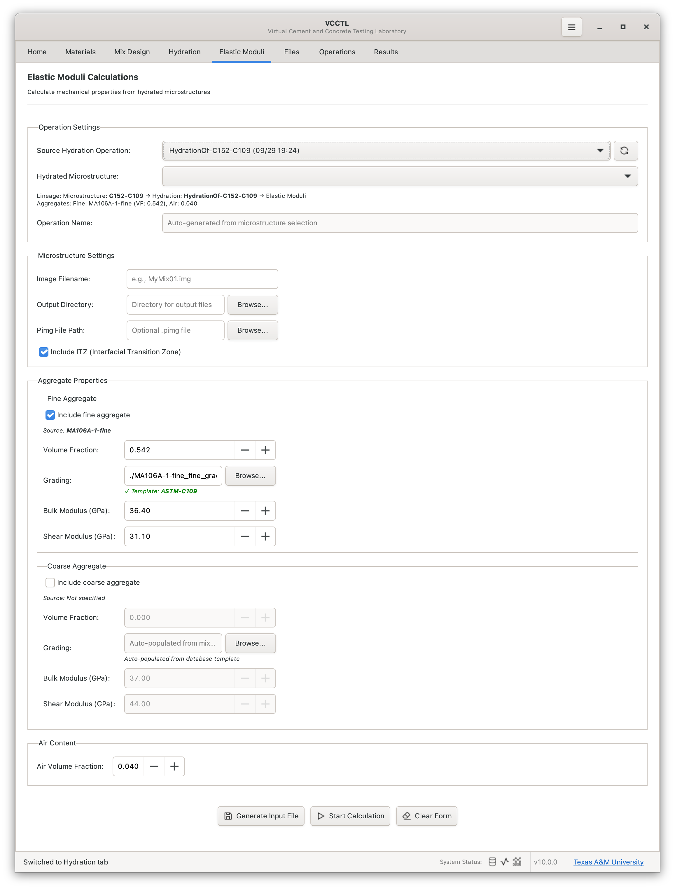
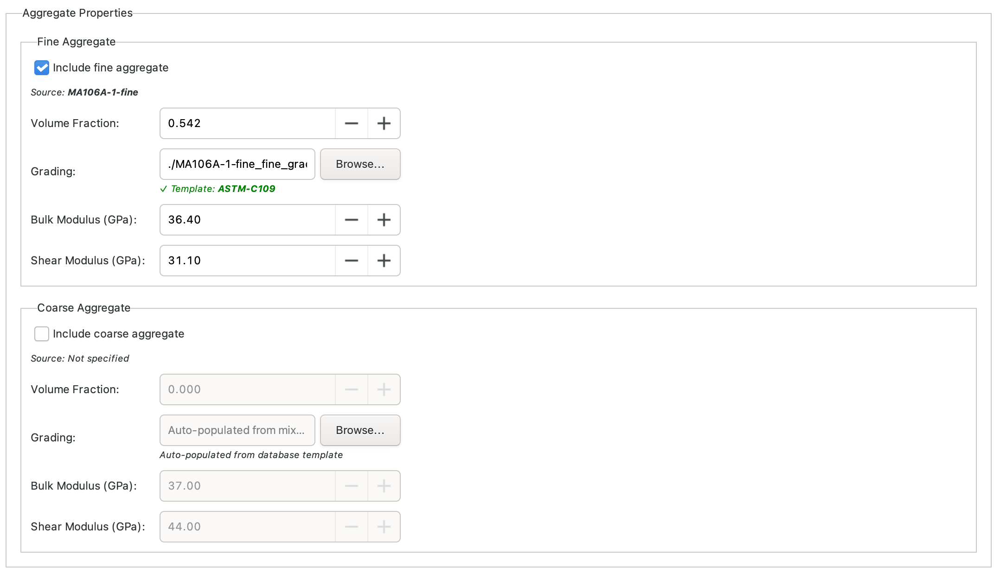
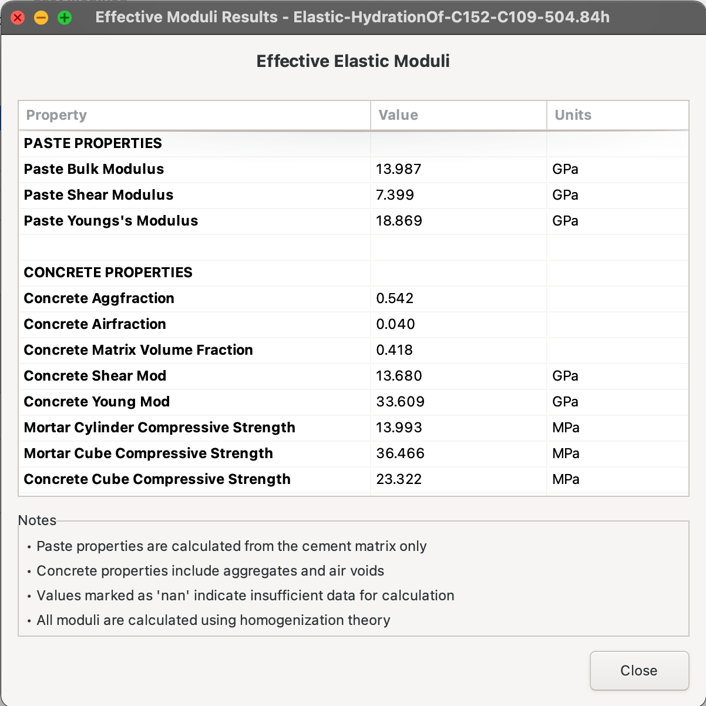

# Elastic Calculations

## Overview

The Elastic Calculations panel in VCCTL enables you to compute the **elastic moduli** (bulk modulus, shear modulus, elastic modulus, and Poisson's ratio) of cement paste microstructures at various stages of hydration. These calculations use finite element analysis to determine how the microstructure's mechanical properties evolve as cement hydrates.

**Key capabilities:**

- Calculate effective elastic properties of hydrated microstructures
- Visualize 3D strain energy distributions
- Examine interfacial transition zone (ITZ) effects on elastic moduli
- Export results for further analysis

!!! tip "Prerequisites"
    Before performing elastic calculations, you must have completed at least one hydration simulation. Elastic calculations are performed on microstructure snapshots saved during hydration.

---

## Understanding Elastic Moduli

VCCTL computes four fundamental elastic properties:

| Property | Symbol | Description | Units |
|----------|--------|-------------|-------|
| **Bulk Modulus** | $K$ | Resistance to hydrostatic stress | GPa |
| **Shear Modulus** | $G$ | Resistance to shape change | GPa |
| **Elastic Modulus** | $E$ | Resistance to axial deformation (Young's modulus) | GPa |
| **Poisson's Ratio** | $\nu$ | Ratio of transverse to axial strain | dimensionless |

These properties are related by:

$$E = \frac{9KG}{3K + G}$$

$$\nu = \frac{3K - 2G}{2(3K + G)}$$

---

## Accessing the Elastic Calculations Panel

1. Click the **Elastic Moduli** tab in the left sidebar
2. The panel displays three main sections:
   - **Hydration Operation Selection**: Choose source hydration
   - **Microstructure Selection**: Select specific hydration time
   - **Aggregate Properties**: Configure aggregate elastic properties

---

## Step 1: Select Source Hydration Operation

The first step is to choose which hydration operation contains the microstructures you want to analyze.

### Selecting a Hydration Operation

1. Click the **"Select Hydration Operation..."** dropdown at the top of the panel
2. Choose from available hydration operations (e.g., "HY-StandardMix-25C")
3. The panel will automatically scan for available microstructure snapshots

!!! note "Nested Operations"
    Elastic calculations are stored within their corresponding hydration operation folder structure: `Operations/HydrationName/ElasticName/`

---

## Step 2: Choose Microstructure Snapshot

After selecting a hydration operation, choose which microstructure snapshot to analyze. These snapshots represent the cement paste microstructure at different hydration times.

### Available Microstructures

The microstructure list shows all the 3D microstructures from which to choose
for this hydration operation. The hydration time (in hours) is embedded within
each name. For example `MyMix.168.09h.25.100` corresponds to hydration of the
microstructure MyMix, hydrated for 168.09 h at 25 °C.

### Selecting a Microstructure

1. Browse the list of available microstructures
2. Click to select the desired hydration time
3. The aggregate properties section will populate automatically

!!! tip "Typical Analysis Times"
    Common hydration times for elastic analysis:

    - **1 day (24h)**: Early-age properties
    - **7 days (168h)**: Development stage
    - **28 days (672h)**: Standard reference age
    - **Final**: Ultimate properties at the final output hydration time

---

## Step 3: Configure Aggregate Properties

If your mix design includes aggregates, you must specify their elastic properties. VCCTL auto-populates these values from your mix design but allows modifications.

### Fine Aggregate Properties

**Volume Fraction**:

- Automatically calculated from mix design
- Represents fraction of total volume occupied by fine aggregate

**Grading Template**:

- Shows the particle size distribution template used
- Displays "Auto-populated from database template" if using default values

**Elastic Properties**:

- **Bulk Modulus** (GPa): Typical values 35-40 GPa for silica sand
- **Shear Modulus** (GPa): Typical values 25-30 GPa for silica sand

### Coarse Aggregate Properties

Similar configuration as fine aggregate:

- Volume fraction from mix design
- Grading template reference
- Bulk and shear moduli (typically slightly higher than fine aggregate)

!!! warning "No Aggregate Adjustments"
    If your mix contains no aggregates, these sections will be empty. The calculation will proceed analyzing paste-only elastic properties.

### Typical Aggregate Elastic Properties

| Aggregate Type | Bulk Modulus (GPa) | Shear Modulus (GPa) |
|----------------|-------------------|---------------------|
| Silica sand/gravel | 37 | 29 |
| Limestone | 50 | 30 |
| Granite | 40 | 25 |
| Basalt | 60 | 35 |

---

## Step 4: Start Elastic Calculation

Once you've configured all parameters, launch the calculation.

### Starting the Calculation

1. Click the **"Start Calculation"** button at the bottom of the panel
2. A dialog appears prompting for an operation name
3. Enter a descriptive name (e.g., "Elastic-StandardMix-28days")
4. Click **"OK"** to begin

!!! tip "Naming Convention"
    Use descriptive names that include:

    - Source hydration operation
    - Hydration time analyzed
    - Any special conditions

    Example: `Elastic-HY-TypeIPaste-7day`

### Calculation Process

The elastic moduli calculation performs the following steps:

1. **Load Microstructure**: Reads the 3D microstructure from the hydration snapshot
2. **Read Cement PSD**: Loads cement particle size distribution as an aid to
   estimating interfacial transition zone thickness
3. **Generate Grading Files**: Creates aggregate size distribution files if needed
4. **Assign Properties**: Maps elastic properties to each phase in microstructure
5. **Iterative Solver**: Performs finite element iterations (typically 40 cycles)
6. **Convergence Check**: Monitors gradient values for solution convergence
7. **Generate Results**: Outputs effective moduli and strain energy data

### Monitoring Progress

Switch to the **Operations** panel to monitor calculation progress:

- **Current Cycle**: Shows iteration number (e.g., "15/40")
- **Progress Percentage**: Completion status
- **Gradient Value**: Convergence indicator (lower is better)

!!! note "Calculation Time"
    Elastic calculations typically take 5-15 minutes depending on:

    - Microstructure size (larger systems take longer)
    - Number of phases present
    - Convergence rate

---

## Step 5: View Results

Once the calculation completes, view and analyze the results through the **Results** panel.

### Accessing Results

1. Switch to the **Results** panel in the left sidebar
2. Locate your elastic operation in the list
3. Available analysis buttons beneath the operation list

### Effective Elastic Moduli

Click **"View Effective Moduli"** to see the computed composite properties.

The results table displays:

| Property | Value | Description |
|----------|-------|-------------|
| **Bulk Modulus** | e.g., 18.5 GPa | Overall resistance to compression |
| **Shear Modulus** | e.g., 11.2 GPa | Overall resistance to shear |
| **Elastic Modulus** | e.g., 28.3 GPa | Young's modulus (most commonly reported) |
| **Poisson's Ratio** | e.g., 0.26 | Lateral strain ratio |

!!! success "Typical Values"
    For mature cement paste (28 days):

    - Elastic modulus: 18 GPa to 25 GPa (paste only)
    - Elastic modulus: 25 GPa to 40 GPa (with aggregates)
    - Poisson's ratio: 0.20 to 0.30

### Exporting Results

Click **"Export"** to save results to CSV format for:

- Plotting elastic moduli evolution over time
- Comparison with experimental measurements
- Integration with structural analysis software

---

## Strain Energy Visualization

The strain energy distribution reveals stress concentrations and mechanical behavior within the microstructure.

### Opening 3D Strain Energy Viewer

1. In the **Results** panel, select your elastic operation
2. Click **"View Strain Energy 3D"**
3. The PyVista 3D viewer opens with strain energy heat map

### Understanding Strain Energy

**Strain energy density** represents the elastic energy stored per unit volume when the material is deformed. Higher values indicate:

- Stress concentration points
- Phase boundaries with property mismatches
- Potential crack initiation sites

### Visualization Controls

**Threshold Range**:

- Adjust **Min** and **Max** sliders to focus on specific energy ranges
- Strain energy is normalized (0.0 to 1.0 scale)

**Preset Views**:

- **Bulk Material (0-0.02)**: View majority of material with low strain energy
- **High Energy Hotspots (0.1-1.0)**: Focus on stress concentration regions
- **Full Range (0-1.0)**: See entire strain energy spectrum

**Rendering Mode**:

- **Isosurface**: Shows 3D surfaces of constant strain energy
- **Volume**: Displays semi-transparent volume rendering

**Cross Sections**:

- **X/Y/Z Plane**: Toggle clipping planes to view internal structure
- Adjust slider to move clipping plane position

### Interpreting Strain Energy

**Low strain energy (blue/green regions)**:

- Indicates relatively uniform stress distribution
- Typically found in bulk cement paste or aggregates

**High strain energy (yellow/red regions)**:

- Stress concentrations at phase boundaries
- Interfacial transition zones (ITZ) around aggregates
- Pores and voids acting as stress concentrators
- Potential microcracking locations under load

!!! tip "Analysis Strategy"
    Start with "High Energy Hotspots" preset to identify critical regions, then switch to "Full Range" to see overall distribution context.

---

## Interfacial Transition Zone (ITZ) Analysis

If your mix contains aggregates, the ITZ analysis reveals how elastic properties vary with distance from aggregate surfaces.

### Opening ITZ Analysis

1. In the **Results** panel, select your elastic operation
2. Click **"View ITZ Analysis"**
3. The ITZ analysis dialog opens with data table and plot

### Understanding the ITZ

The **interfacial transition zone** is a region of altered microstructure around aggregate particles, typically characterized by:

- Higher porosity than bulk paste
- Different hydration product proportions
- Lower mechanical properties
- Width typically 10 μm to 50 μm

### ITZ Plot Features

The plot shows how elastic properties (*e.g.*, bulk modulus, shear modulus) vary with distance from aggregate surfaces:

**Data Points (blue)**:

- Each point represents a voxel's property vs. distance from nearest aggregate
- Scatter shows microstructural heterogeneity

**ITZ Width Line (green dashed vertical)**:

- Located at the median cement particle diameter
- Represents the characteristic ITZ extent
- Calculated from cement particle size distribution

**Average Property Lines (horizontal dashed)**:

- **Orange line**: Average property within ITZ (distance ≤ ITZ width)
- **Purple line**: Average property outside ITZ (distance > ITZ width)
- Shows quantitative difference between ITZ and bulk properties

**Text Annotations**:

- Display exact average values for easy comparison
- Colored backgrounds match corresponding lines

### Interpreting ITZ Results

**Property decrease in ITZ**:

- Values drop near aggregate surfaces (distance ≈ 0)
- Lower properties due to increased porosity
- Indicates potential weak zone for crack propagation

**Property recovery in bulk**:

- Values increase with distance from aggregates
- Plateau at bulk paste properties
- Distance at which properties stabilize indicates effective ITZ width

**Comparison to experiments**:

- ITZ width typically 10 μm to 50 μm in real concrete
- Modulus reductions of 20% to 40% is common in ITZ
- Data can validate simulation against experimental measurements

### Exporting ITZ Data

1. Click **"Export Data"** in the ITZ analysis dialog
2. Saves CSV file with columns:
   - Distance from aggregate (μm)
   - Bulk modulus (GPa)
   - Shear modulus (GPa)
   - Elastic modulus (GPa)
   - Poisson's ratio
3. Use for further analysis or publication-quality plotting

---

## Analyzing Elastic Property Evolution

To understand how mechanical properties develop during hydration, perform elastic calculations at multiple time points.

### Workflow for Time Series Analysis

1. **Select multiple microstructures** from the same hydration operation:
   - 1 day, 7 days, 28 days, *etc*.

2. **Run elastic calculations** for each time point:
   - Use consistent aggregate properties
   - Use systematic naming (*e.g.*, "Elastic-Mix-1d", "Elastic-Mix-7d")

3. **Export results** from each calculation

4. **Plot evolution**:
   - Time (days) on X-axis
   - Elastic modulus (GPa) on Y-axis
   - Compare simulation to experimental data

### Typical Evolution Patterns

**Early age (0 days to 3 days)**:

- Rapid increase in elastic modulus
- Properties develop as hydration products form
- Rate depends on cement composition and temperature

**Development period (3 days  to 28 days)**:

- Continued increase at decreasing rate
- Most strength gain occurs here
- Properties approach 80-90% of ultimate

**Long term (28+ days)**:

- Asymptotic approach to final properties
- Very slow continued development
- Ultimate properties depend on water-cement ratio

---

## Troubleshooting

### Calculation Fails to Start

**No microstructures available**:

- Ensure you've completed a hydration simulation first
- Check that hydration operation generated snapshots
- Verify Operations folder contains hydration results

**Missing aggregate properties**:

- If calculation requires aggregates, all properties must be specified
- Use default values if unsure (bulk: 37 GPa, shear: 29 GPa)

### Calculation Doesn't Complete

**Slow convergence**:

- Check progress panel for gradient values
- If gradient not decreasing, microstructure may have issues
- Try with different microstructure snapshot

**Memory issues**:

- Large microstructures (>200×200×200) may require significant RAM
- Consider using smaller system sizes in mix design

### Unrealistic Results

**Elastic modulus too high or too low**:

- Verify aggregate elastic properties are reasonable
- Check that microstructure hydration reached expected degree
- Ensure proper units (GPa for moduli)

**ITZ analysis shows no variation**:

- Requires aggregates in mix design
- ITZ effects may be subtle at early ages
- Ensure sufficient spatial resolution in microstructure

---

## Best Practices

### Analysis Planning

1. **Choose representative times**: 1d, 3d, 7d, 28d standard sequence
2. **Consistent properties**: Use same aggregate values for all times
3. **Systematic naming**: Include hydration time in operation names
4. **Document settings**: Record all parameters for reproducibility

### Result Validation

1. **Compare to experiments**: Match simulation conditions to lab tests
2. **Check property relationships**: Verify Poisson's ratio in reasonable range (0.15-0.35)
3. **Assess convergence**: Final gradient should be < 0.05
4. **Cross-check**: Ensure elastic modulus matches expected range for mix

### Computational Efficiency

1. **Run in sequence**: Multiple elastic calculations can run simultaneously
2. **Monitor progress**: Check Operations panel to detect problems early
3. **Archive results**: Export data after successful calculations
4. **Clean old operations**: Remove test calculations to keep database organized

---

## Advanced Topics

### Effect of Aggregate Content

Higher aggregate volume fractions increase overall elastic modulus:

- Pure paste: ~18 GPa to 25 GPa at 28 days
- With 30% aggregates: ~30 GPa to 35 GPa at 28 days
- With 60% aggregates: ~35 GPa to 45 GPa at 28 days

The relationship is **non-linear** due to ITZ effects and particle interactions.

### Effect of Water-Cement Ratio

Lower w/c ratios produce higher elastic moduli:

- w/c = 0.30: ~25 GPa to 28 GPa (paste at 28d)
- w/c = 0.40: ~20 GPa to 23 GPa
- w/c = 0.50: ~16 GPa to 19 GPa

This occurs because lower w/c ratios have:

- Less porosity at given hydration degree
- Denser hydration product structure
- Better load transfer between particles

### Temperature Effects

Temperature affects hydration rate but **not** intrinsic phase properties:

- Higher temperature: faster property development
- Same ultimate properties at full hydration
- Elastic moduli at same degree of hydration are nearly identical

Perform calculations on microstructures at **same degree of hydration** for valid temperature comparisons, not same chronological age.

---

## Summary

The Elastic Calculations feature in VCCTL provides:

- ✅ Accurate prediction of cement paste mechanical properties
- ✅ 3D visualization of strain energy distributions
- ✅ ITZ analysis showing property gradients near aggregates
- ✅ Time evolution data for property development studies
- ✅ Validation data for comparison with experimental measurements

These calculations enable you to:

- **Predict** mechanical performance before physical testing
- **Optimize** mix designs for target elastic moduli
- **Understand** microstructural features affecting properties
- **Validate** simulation accuracy against experiments
- **Publish** high-quality micromechanics research

!!! success "Next Steps"
    After completing elastic calculations, explore:

    - [Results Visualization](results-visualization.md) - View all operation outputs
    - [Operations Monitoring](operations-monitoring.md) - Manage calculations
