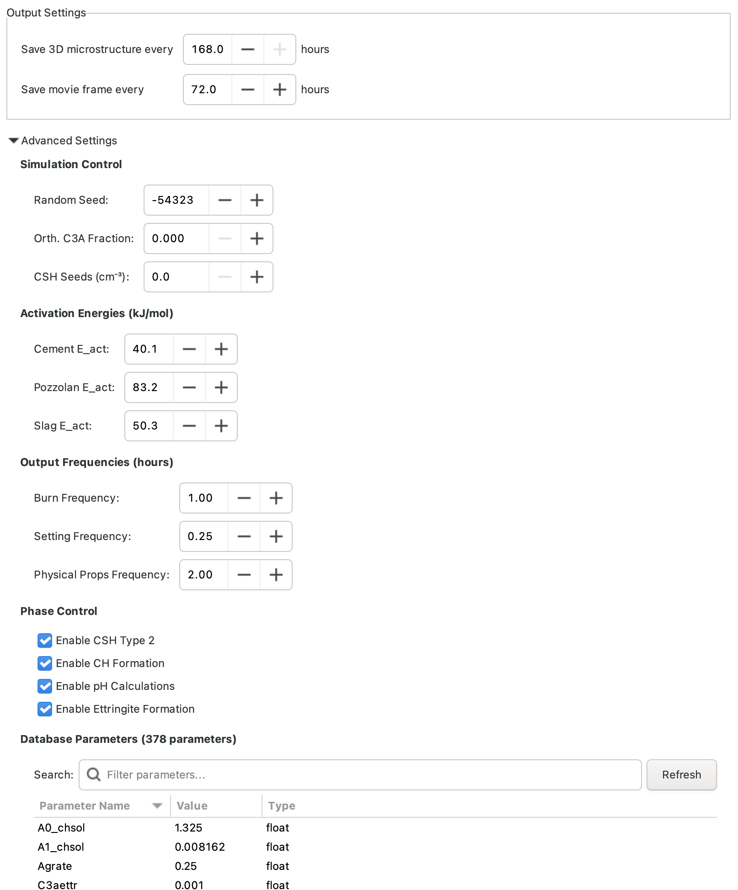
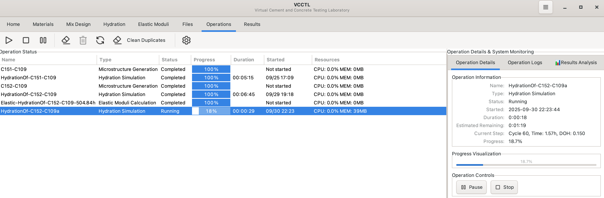
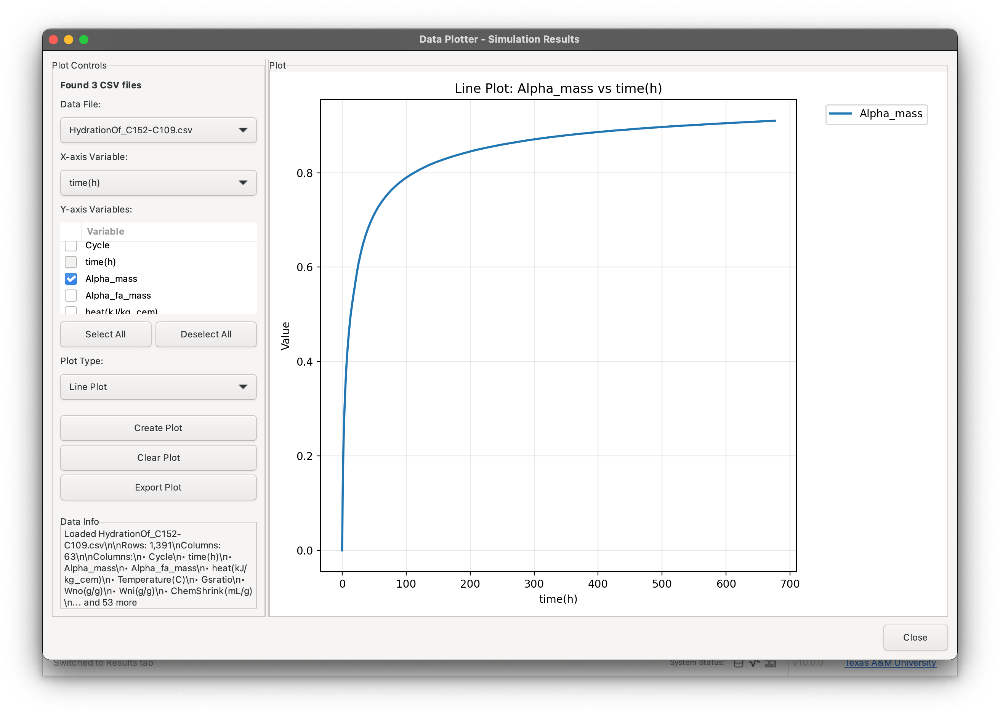
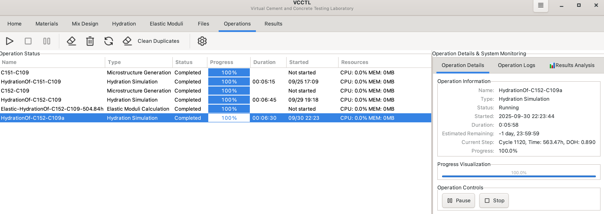

# Hydration Simulation

The Hydration panel simulates cement hydration reactions over time, transforming your generated microstructure through chemical reactions that model the curing process. This simulation predicts microstructure evolution, phase development, heat generation, and property changes as concrete hardens.


## Overview

Hydration simulations in VCCTL:

- **Start from generated microstructures** - Select a completed microstructure operation as input
- **Simulate chemical reactions** - Model dissolution of cement phases and formation of hydration products
- **Track phase evolution** - Monitor C-S-H, portlandite, ettringite, and other phase development
- **Calculate degree of hydration** - Quantify reaction progress over time
- **Predict heat generation** - Model temperature rise for isothermal or adiabatic curing
- **Enable property calculations** - Provide input for elastic moduli and transport property calculations

## Hydration Panel Interface

### Selecting a Source Microstructure


Before configuring hydration parameters, select the microstructure to hydrate:

1. Provide a unique name for the hydration operation that will run
2. Click **Select Microstructure** button
3. Choose from list of completed microstructure operations
4. Microstructure parameters (size, resolution, materials) load automatically

The source microstructure provides:
- Initial phase distribution
- Particle positions and sizes
- Material properties
- System dimensions

## Simulation Parameters

### Basic Settings

**Time & Cycles:**
- Total hydration time to simulate (hours)
- Typical: 168 hours (7 days) to 1344 hours (56 days)
- Longer times show long-term property development

**Output Settings:**
- How often to save results (simulation hours)
- Typical: Save every 1 hour to every 24 hours
- More frequent saves = more large data files
- You can also save a 2D slice of the microstructure at constant time intervals,
  which the simulation will then use to create an animation of hydration of that
  slice.

## Time Calibration

Hydration kinetics depend on material properties and can be calibrated to match experimental data.

### Knudsen Parabolic Law


**Parabolic Time Conversion:**

The Knudsen parabolic law models diffusion-controlled reaction kinetics:

$$t_{real} = t_{sim} \times k^2$$

where:
- $t_{real}$ = Real hydration time
- $t_{sim}$ = Simulation cycles
- $k$ = Time conversion factor (h⁻²)

**Time Conversion Factor:**
- **Default**: 0.00045 h⁻² (typical for Portland cement)
- **Range**: 0.0001 to 0.001 h⁻²
- Higher values = faster simulated reactions
- Calibrate to match experimental degree of hydration data

**Use cases:**
- Default simulation without experimental data
- Preliminary predictions
- Parametric studies

### Calorimetry Data Calibration


**Match Experimental Heat Release:**

Calibrate using isothermal calorimetry measurements:

1. **Upload Data File**: CSV with time (hours) and heat (J/g cement)
2. **Specify Temperature**: Temperature of calorimetry test (°C)
3. **Auto-Calibration**: VCCTL adjusts time conversion to match data

**Data Format:**
```
Time_hours,Heat_J_per_g
0.0,0.0
1.0,2.5
2.0,8.3
24.0,182.5
168.0,355.0
```
**Benefits:**
- Most accurate predictions
- Accounts for specific cement reactivity
- Matches experimental kinetics
- Validates simulation results

**Use cases:**
- High-accuracy predictions for specific materials
- Validation studies
- Calibrating novel cement formulations

### Curing Conditions

#### Isothermal Curing


**Constant Temperature:**
- Temperature remains fixed throughout simulation
- Typical: 20°C to 25°C for standard lab curing
- Higher temperatures accelerate hydration
- Lower temperatures slow hydration

**Use cases:**
- Standard laboratory curing conditions
- Predicting strength development at constant temperature
- Comparing different mix designs under controlled conditions

#### Adiabatic Curing


**No Heat Loss:**
- Temperature rises naturally from heat of hydration
- Simulates interior of massive concrete structures
- Peak temperature depends on cement content and reactions

**Adiabatic Parameters:**
- **Initial Temperature**: Starting temperature (typically 20-25°C)
- **Specific Heat**: Concrete heat capacity (kJ/(kg·K), typically 0.8-1.0)
- **Density**: Concrete mass density (kg/m³, typically 2200-2400)

**Use cases:**
- Mass concrete structures (dams, foundations, walls)
- Predicting peak temperature rise
- Assessing thermal cracking risk
- Evaluating effect of SCMs on heat reduction

### Temperature Profile


For realistic field conditions, define a custom temperature profile:

**Profile Types:**
- **Constant**: Isothermal (single temperature)
- **Linear Ramp**: Temperature changes linearly over time
- **Custom**: User-defined time-temperature points

#### Temperature Profile Editor


**Custom Profile Creation:**
1. Click **Edit Profile** button
2. Add time-temperature points
3. Points auto-connect with linear interpolation
4. Preview profile graph updates in real-time

**Example seasonal profile:**
- 0 hours: 15°C (spring placement)
- 168 hours: 25°C (summer warming)
- 336 hours: 20°C (fall cooling)

**Use cases:**
- Seasonal temperature variations
- Day-night temperature cycles
- Steam curing schedules
- Pre-cooling or heating protocols

## Advanced Parameters



### Chemical Composition Adjustments

**Orthorhombic C₃A Fraction:**
- Fraction of C₃A that is orthorhombic
- Default: 0.0 (all C₃A is the cubic polymorph)
- Range: 0.0 to 1.0

**CSH Seeds:**
- Number of seeds per cm³; useful for simulating the effects of additives like
colloidal silica that encourage CSH gel nucleation and produce more uniform
microstructures.
- Default: 0 (no seeds)
- Adjust for specific cement characteristics
- Typical Range: 0 to 10,000

### Activation Energies

Activation energies are used to set the temperature sensitivity of different
kinds of hydraiton reactions. Higher values of the activation energy imply
greater sensitivity of the reaction rate to temperature changes.

**Cement E_act**
- Applies to all clinker dissolution reactions, sulfate dissolution, *etc*
- Typical value is 40 kJ/mol to 45 kJ/mol
- Default: 40 kJ/mol

**Pozzolan E_act**
- Applies to fly ash and silica fume reactions
- Typical value is 50 kJ/mol to 60 kJ/mol
- Default: 55 kJ/mol

**Slag E_act**
- Applies to blast furnace slag reactions
- Typical value is 50 kJ/mol to 60 kJ/mol
- Default: 50 kJ/mol

## Phase Control

This section can be used to fine-tune certain behaviors of teh hydration
reaction and simulation output:

- **Enable CSH Type 2** - check this box to allow normal CSH gel to convert to a
  lower Ca/Si ratio form when pozzolans are present in the mixture
- **Enable CH formation** - check this box to allow calcium hydroxide to
precipitate on aggregate surfaces
## Phase Control

This section can be used to fine-tune certain behaviors of teh hydration
reaction and simulation output:

- **Enable formation of low Ca/Si CSH** - check this box to allow normal CSH gel to convert to a
  lower Ca/Si ratio form when pozzolans are present in the mixture
- **Allow CH to precipitate on aggregate surfaces** - check this box to allow calcium hydroxide to
precipitate on aggregate surfaces
- **Enable pH calculations** - check this box to allow the model to estimate the
pH as hydration progresses, using an empirical chemical model
- **Allow formation of iron-rich ettringite** - check this box to allow the precipitation of
an iron-rich form of ettringite when the C₄AF content is high enough in the
original cement.
 
## Database Modifications


Fine-tune kinetic parameters for specific cements, conditions, or reactions.

**WARNING**: Only the most experienced users who have a thorough knowledge of the hydration simulation code
should adjust any of these parameters. It is highly recommended that any user
should consult the code developers before attempting to change these parameters.

## Starting the Simulation


Once all parameters are configured:

1. **Enter Operation Name** - Unique identifier for this hydration run
2. **Review Parameters** - Check all settings are correct
3. **Click Start Hydration** - Launches simulation

**Naming Convention:**
- Include parent microstructure name for traceability
- Example: "OPC-035-w/c-7days" or "HPC-FlyAsh-30days"

**Simulation runs in background:**
- Monitor progress in Operations panel
- Continue working in VCCTL
- Multiple simulations can run simultaneously

## Monitoring Progress



While hydration runs, the Operations panel shows:

- **Current Time**: Simulation time elapsed (hours)
- **Percent Complete**: Progress toward target time
- **Degree of Hydration**: Current α (0.0 to 1.0)
- **Temperature**: Current temperature (if adiabatic or variable)
- **Estimated Time Remaining**: Predicted time to completion

**Typical Run Times:**
- Small system (100³ voxels), 7 days: 30-60 minutes
- Medium system (150³ voxels), 7 days: 1-3 hours
- Large system (200³ voxels), 28 days: 6-12 hours

## Viewing Results

### Degree of Hydration Plot



After simulation completes, view degree of hydration vs. time:

- **Main curve**: α(t) showing reaction progress
- **Rate curve**: dα/dt showing reaction rate
- **Key points**: Initial, final, and inflection points marked

**Interpretation:**
- **Rapid initial rise**: Dissolution of cement particles
- **Peak rate**: Maximum reaction velocity (typically 6-24 hours)
- **Gradual approach to final α**: Diffusion-limited phase
- **Final plateau**: Ultimate degree of hydration

### 3D Results Viewer


View the evolved microstructure in 3D:

**Phase visualization:**
- **Unhydrated cement**: Original cement particles (shrinking)
- **C-S-H**: Calcium silicate hydrate (growing)
- **Portlandite**: CH crystals
- **Ettringite**: AFt needles
- **Pore space**: Capillary porosity (decreasing)

**Interactive features:**
- Rotate, pan, zoom
- Toggle phases on/off
- Cross-section slicing
- Measure distances
- Export images

### Completion Status



Completed hydration operations show:
- Final degree of hydration achieved
- Phase volume fractions
- Total simulation time
- Output files generated

## Output Files

Successful hydration simulations generate:

**Phase Images:**
- `{operation}_final.img` - Final phase microstructure
- `{operation}_00XX.img` - Intermediate snapshots

**Data Files:**
- `hydration_data.csv` - Time, α, phase volumes
- `temperature_history.csv` - Temperature vs. time (if variable)
- `heat_release.csv` - Cumulative heat generation

**Metadata:**
- `{operation}_metadata.json` - All simulation parameters
- `hydration.log` - Detailed simulation log

## Best Practices

### Simulation Time Selection

**Short Simulations (1 day to 7 days):**
- Good for: Early age behavior, setting time, initial strength
- Typical α: 0.5 to 0.7
- Fast computation

**Medium Simulations (7 days to 28 days):**
- Good for: Standard strength development, property predictions
- Typical α: 0.7 to 0.85
- Balanced accuracy/speed

**Long Simulations (28 days to 90+ days):**
- Good for: Long-term properties, SCM reaction, durability
- Typical α: 0.85 to 0.95
- Slow but most complete

### Temperature Effects

**Temperature Dependence:**
- Hydration rate roughly **doubles** per 10°C increase
- 5°C: Very slow, may not reach full hydration
- 20°C to 25°C: Normal curing, standard predictions
- 40°C to 60°C: Accelerated curing, steam curing
- >70°C: May alter hydration products (VCCTL not tested in this range)

**Adiabatic Temperature Rise:**
- **Low cement (300 kg/m³)**: ΔT ≈ 20°C to 30°C
- **Normal cement (400 kg/m³)**: ΔT ≈ 35°C to 50°C
- **High cement (500 kg/m³)**: ΔT ≈ 50°C to 70°C
- **SCMs reduce temperature rise** (slag > fly ash > silica fume)

### Calibration Strategy

**Without Experimental Data:**
1. Use default Knudsen parabolic conversion (k = 0.00035 h⁻²)
2. Validate predictions against literature data
3. Perform sensitivity analysis

**With Calorimetry Data:**
1. Use isothermal calorimetry at 20°C to 25°C
2. Upload complete heat curve (0 hours to 168+ hours)
3. Let VCCTL auto-calibrate
4. Verify fit quality

**With Strength Data:**
1. Run simulation with default parameters
2. Calculate elastic moduli from hydrated microstructure
3. Compare to experimental strength development
4. Adjust kinetic parameters if needed

## Common Simulation Examples

### Example 1: Standard Isothermal Curing

**Application**: Lab-cured concrete cylinders for strength testing

**Parameters:**
- Source: Normal strength concrete microstructure (w/c = 0.45)
- Simulation Time: 168 hours (7 days)
- Temperature: 23°C (isothermal)
- Time Calibration: Default Knudsen (k = 0.00035 h⁻²)

**Expected Results:**
- Final α ≈ 0.70 to 0.75
- Peak heat rate: ~3 mW/g to 5 mW/g at 8 hours to 12 hours
- Portlandite: ~20% to 25% of solids volume

### Example 2: Adiabatic Mass Concrete

**Application**: Dam or foundation pour, thermal cracking assessment

**Parameters:**
- Source: Normal concrete with 30% fly ash replacement
- Simulation Time: 720 hours (30 days)
- Curing: Adiabatic, initial T = 20°C

**Expected Results:**
- Peak temperature: ~55°C to 65°C between 12 hours and 24 hours
- Final α ≈ 0.75 to 0.80
- Fly ash reduces peak T by ~10 °C to 15°C compared to plain cement

### Example 3: Steam Curing

**Application**: Precast concrete products, rapid strength gain

**Parameters:**
- Source: High early strength concrete (Type III cement)
- Simulation Time: 48 hours
- Temperature Profile:
  - 0-3 hours: Ramp 20°C to 65°C
  - 3-12 hours: Hold 65°C
  - 12-15 hours: Ramp 65°C to 20°C
  - 15-48 hours: Hold 20°C

**Expected Results:**
- α ≈ 0.65 at 12 hours (end of steam)
- Rapid early strength development
- Less portlandite formation at elevated temperature

## Troubleshooting

### Common Issues

**Problem**: Simulation runs very slowly
**Solution**: Reduce system size, or reduce simulation time. Check that other processes aren't consuming CPU.

**Problem**: Unrealistic degree of hydration (α > 1.0 or negative)
**Solution**: Check time conversion factor is reasonable (0.0001-0.001 h⁻²). Verify input microstructure has valid phase assignments.

**Problem**: Temperature rise too high/low in adiabatic mode
**Solution**: Check density and specific heat values. Verify cement content and heat of hydration parameters. Compare to analytical calculations.

**Problem**: Simulation crashes or produces errors
**Solution**: Check that source microstructure is valid. Verify all parameters are in reasonable ranges. Examine hydration.log file for error messages.

### Validation Checks

**Degree of Hydration:**
- 1 day: α ≈ 0.40 to 0.55 (normal cement, 20°C)
- 7 days: α ≈ 0.65 to 0.75
- 28 days: α ≈ 0.75 to 0.85
- 90 days: α ≈ 0.80 to 0.90

**Phase Volumes (typical for w/c = 0.40-0.50):**
- Unhydrated cement: 5% to 20% at 28 days
- C-S-H: 50% to 65% of solids
- Portlandite: 15% to 25% of solids
- Ettringite: 5% to 10% of solids
- Capillary porosity: 20% to 35% of total volume

**Heat Release (cumulative at 20°C):**
- 1 day: ~100 J/g cement to 150 J/g cement
- 7 days: ~250 J/g cement to 300 J/g cement
- 28 days: ~320 J/g cement to 380 J/g cement

**Peak Temperature (adiabatic, w/c = 0.45):**
- 350 kg/m³ cement: ΔT ≈ 30°C to 40°C
- 400 kg/m³ cement: ΔT ≈ 40°C to 50°C
- 450 kg/m³ cement: ΔT ≈ 50°C to 60°C

---

**Next Steps:**
- **[Elastic Calculations](elastic-calculations.md)** - Calculate mechanical properties from hydrated microstructure
- **[Results Visualization](results-visualization.md)** - Analyze phase evolution and property development
- **[Mix Design](mix-design.md)** - Return to modify mixture proportions
