# Materials Management

The Materials panel is your central hub for defining and managing the raw materials used in concrete mix designs. VCCTL supports six material types with complete property definitions and particle size distribution (PSD) configurations.


## Supported Material Types

VCCTL supports six material types, each with specific properties:

1. **Cement** - Portland cement and blended cements with Bogue phase composition
2. **Aggregate** - Fine and coarse aggregates with grading curves
3. **Fly Ash** - Class F and Class C fly ash supplementary cementitious materials
4. **Slag** - Ground granulated blast-furnace slag (GGBFS)
5. **Silica Fume** - Ultra-fine pozzolanic material
6. **Limestone** - Limestone powder filler material
7. **Filler** - General inert filler materials

## Materials Panel Interface

### Toolbar

The Materials toolbar provides quick access to common operations:

- **Filter** - filter the displayed list by material type
- **+ Add** - Create new material of any type

### Materials List

The main list displays all available materials with:

- **Material Name** - User-defined identifier
- **Type** - Material category (Cement, Aggregate, etc.)
- **Specific gravity**
- **Date created** and **Date modified**


You can switch between material types using the filter dropdown or search by name.


### Context Menu

Right-click any material for quick access to operations:

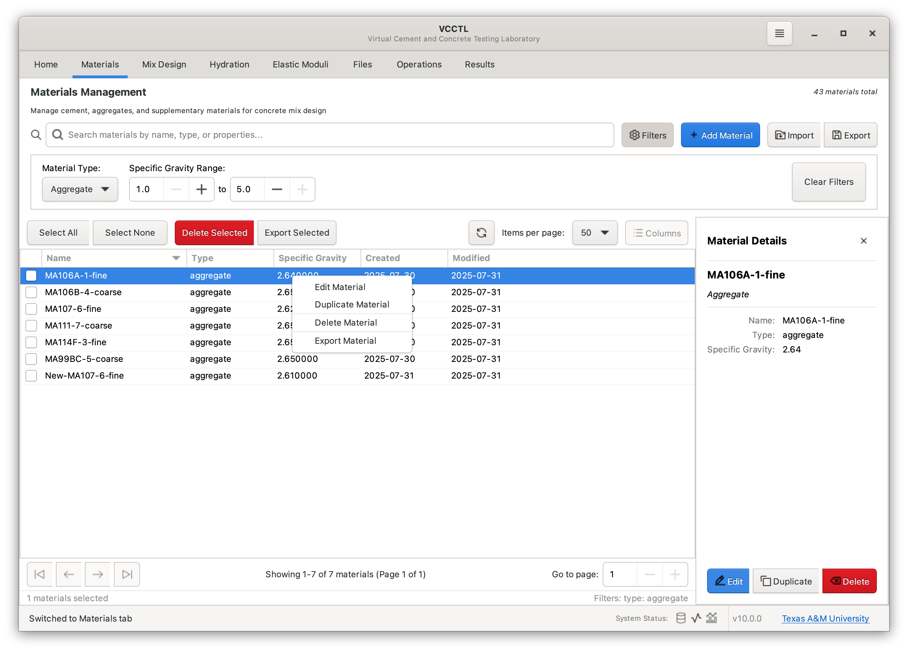

- **Edit Material** - Modify material properties
- **Duplicate Material** - Create a copy with modified name
- **Delete Material** - Remove from database (with confirmation)
- **Export Material** - Disabled for now

## Creating and Editing Materials

### General Workflow

1. Click **"+ Add"** in the toolbar
2. Select material type from dropdown
3. Enter material name (must be unique)
4. Fill in properties across multiple tabs:
   - **Basic** - Essential identification and basic properties
   - **Chemical Properties** - composition 
   - **Physical Properties** - density and particle size distribution
   - **PSD** - Particle size distribution configuration
   - **Advanced** - Additional parameters and settings
5. Click **Save** to store material in database

### Validation

VCCTL validates all material properties:

- **Required fields** - Must be filled before saving
- **Numeric ranges** - Properties must be physically reasonable
- **Name uniqueness** - No duplicate material names allowed
- **PSD consistency** - Distribution parameters must be valid

## Cement Materials

Cement is the primary binder in concrete. VCCTL supports detailed cement characterization including phase composition and particle size distribution.

### Basic Properties


- **Name** - Unique identifier (e.g., "OPC Type I", "ASTM C150-TypeII")
- **Description** - Optional detailed notes

### Physical Properties

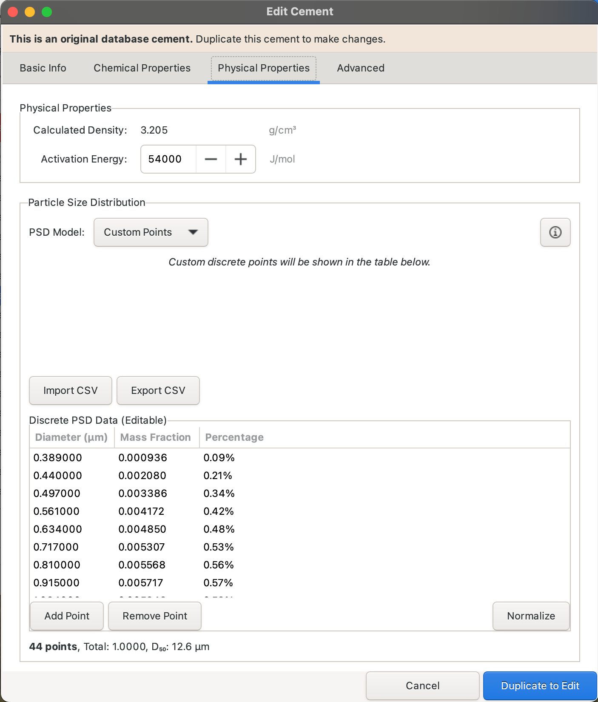

- **Bulk Density** - Typically 3100-3200 kg/m³ for Portland cement
- **Specific Gravity** - Typically 3.10-3.20 for Portland cement
- **Blaine Fineness** - Surface area in m²/kg (typically 300-400 m²/kg)

### Phase Composition

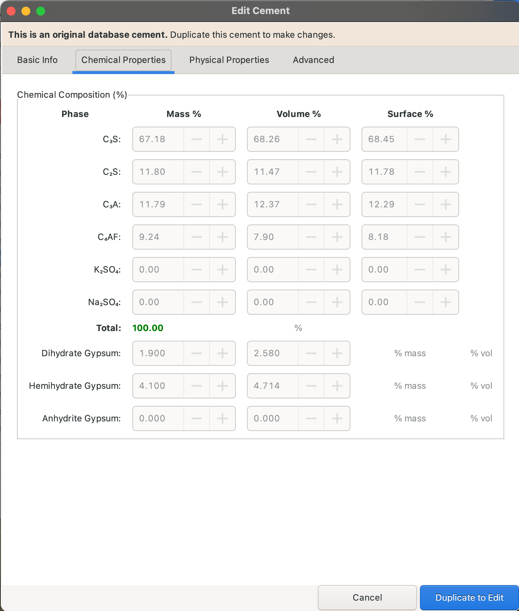

Enter clinker phase composition (mass percentages must sum to 100):

- **C3S (Alite)** - Tricalcium silicate (typically 50% to 70%)
- **C2S (Belite)** - Dicalcium silicate (typically 10% to 30%)
- **C3A (Aluminate)** - Tricalcium aluminate (typically 5% to 15%)
- **C4AF (Ferrite)** - Tetracalcium aluminoferrite (typically 5% toi 15%)
- **Gypsum**, **Hemihydrate**, and **Anhydrite** - Calcium sulfates (typically sums to 3% to 6%)

**Typical Composition Examples:**

| Cement Type | C3S | C2S | C3A | C4AF | Gypsum | Inert |
|------------|-----|-----|-----|------|--------|-------|
| Type I (General) | 55% | 18% | 10% | 8% | 5% | 4% |
| Type II (Moderate sulfate) | 50% | 22% | 6% | 11% | 5% | 6% |
| Type III (High early) | 60% | 12% | 12% | 8% | 5% | 3% |
| Type IV (Low heat) | 40% | 40% | 4% | 12% | 4% | 0% |

### Particle Size Distribution


Configure cement particle size distribution (see [PSD Configuration](#particle-size-distributions) section for details).

Typical cement PSD parameters:
- **Distribution Type**: Rosin-Rammler
- **Minimum Size**: 0.5 μm
- **Maximum Size**: 50-100 μm
- **Characteristic Size**: 10-20 μm (related to Blaine fineness)
- **Spread Parameter**: 0.8-1.2

### Advanced Settings


- **Heat of Hydration** - Enthalpy values for each phase (J/g)
- **Dissolution Kinetics** - Rate parameters for hydration model
- **Custom Properties** - Additional material-specific parameters

## Aggregate Materials

Aggregates (sand and gravel) provide volume and structural integrity. VCCTL supports detailed grading curve definitions.

### Basic Properties

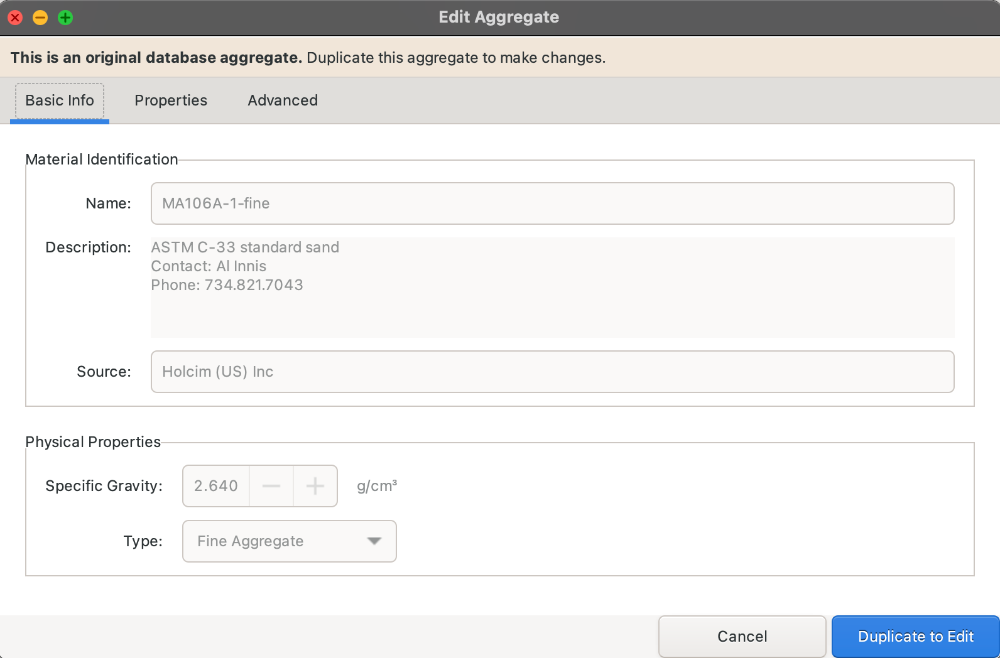

- **Name** - Unique identifier
- **Description** - Optional, good for describing source and mineralogy
- **Specific Gravity** - Fine aggregate or Coarse aggregate

### Physical Properties

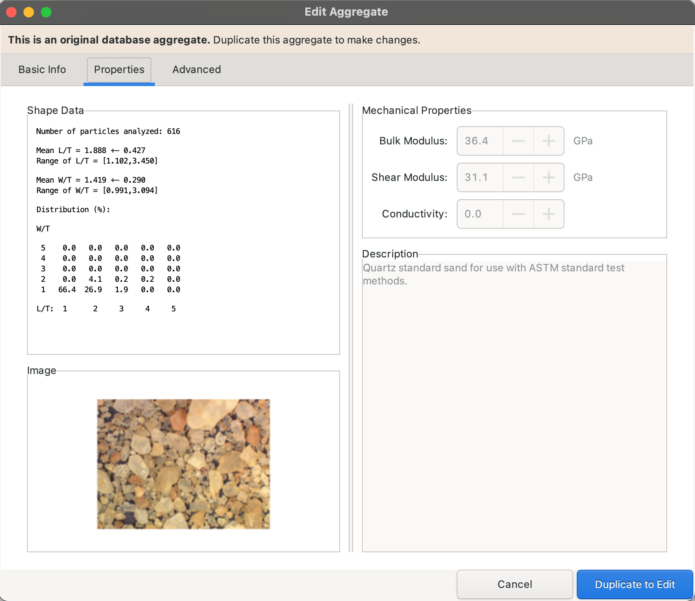

- **Shape Data** - Basic statistics of shape characteristics for length, width,
  and thickness
- **Image** - A photograph of representative aggregate particles
- **Mechanical Properties** - Shear modulus, bulk modulus, and relative
diffusion coeffient (conductivity)
- **Description** - Optional information about the aggregate

### Advanced Settings


- Optional data about the provenance, location, naming conventions, or any other
  useful information

## Fly Ash Materials

Fly ash is a pozzolanic supplementary cementitious material produced from coal combustion.

### Basic Info


- **Name** - Unique identifier
- **Description** - Optional notes
- **Source** - Origin, manufacturer, or supplier information

### Properties


- **Chemical Composition** - primary oxide mass percentages
- **Alkali Characteristics** - sodium and potassium oxide content
    - **Note**: the mass percentages of primary oxides and alklali oxides should
      total 100
- **Classification** - ASTM class of the ash (F, C, or N)
- **Activation energy** - Temperature dependence of ash reaction rates
- **Particle Size Distribution** - Rosin-Rammler, Log-Normal, Fuller-Thompson, or custom
    user-defined data

### Advanced Settings


- **Metadata** - Useful information on the provenance, naming conventions,
case studies, or other helpful properties
- **Performance Properties** - Optional information and cautions

## Slag Materials

Ground granulated blast-furnace slag (GGBFS) is a latent hydraulic binder.

### Basic Info


- **Name** - Unique identifier
- **Description** - Optional notes
- **Source** - Origin, manufacturer, or supplier information
- **Specific Gravity** - Typically 2.85-2.95
- **Glass Content** - typically > 95% by mass

### Properties


- **Chemical Composition** - primary oxide mass percentages (should total 100)
- **Activation energy** - Temperature dependence of ash reaction rates
- **Reactivity Factor** - Bias in reaction rates relative to a VCCTL baseline
- **Particle Size Distribution** - Rosin-Rammler, Log-Normal, Fuller-Thompson, or custom
    user-defined data

### Advanced Settings


- **Metadata** - Useful information on the provenance, naming conventions,
case studies, or other helpful properties
- **Ratio Characteristics** - Calculated from user input

## Silica Fume Materials

Silica fume (microsilica) is a pozzolanic, silica-rich material with ultrafine
primary particles. It is typically used in "undensified" or "densified" form,
the latter being an intentional hard agglomeration of the ultrafine primary
particles into much larger spheroidal granules that are often difficult to
break down mechanically.

### Basic Info

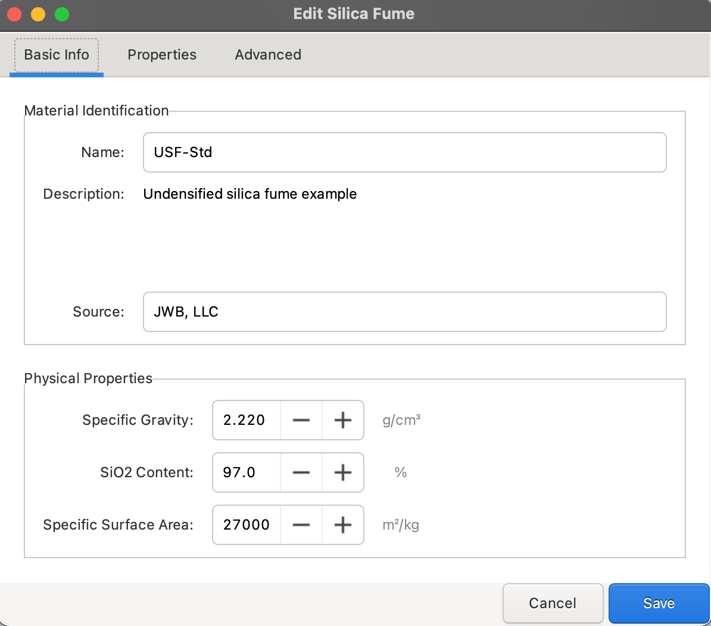


- **Name** - Unique identifier
- **Description** - Optional notes
- **Source** - Origin, manufacturer, or supplier information
- **Specific Gravity** - Typically 2.85-2.95
- **SiO2 Content** - Weight percentage on a total solids basis
- **Specific Surface Area** - typically > 25000 m²/kg

### Properties


- Silica fume particle size distribution (see [PSD Configuration](#particle-size-distributions) section for details).

- Typical cement PSD parameters:
    - **Distribution Type**: Rosin-Rammler
    - **Minimum Size**: 0.5 μm
    - **Maximum Size**: 10 μm
    - **Characteristic Size**: 5.0 μm

### Advanced Settings

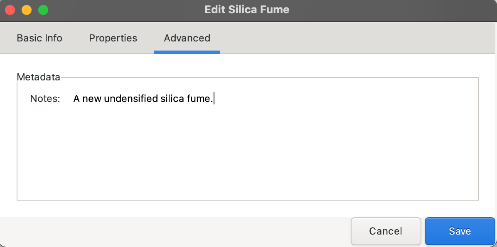

- **Metadata** - A text field for writing notes on provenance, case studies, or
  anything else relevant to the material.

## Limestone Materials

Limestone powder is an inert or slightly reactive filler material.

### Basic Info


- **Name** - Unique identifier
- **Description** - Optional notes
- **Source** - Origin, manufacturer, or supplier information
- **Specific Gravity** - Typically 2.6 to 2.65
- **CaCO3 Content** - Weight percentage on a total solids basis
- **Specific Surface Area** - typically > 25000 m²/kg

### Properties


- **Activation Energy** - Typically 45 kJ/mol to  55 kJ/molg

- Limestone particle size distribution (see [PSD Configuration](#particle-size-distributions) section for details).

- Typical cement PSD parameters:
    - **Distribution Type**: Rosin-Rammler
    - **Minimum Size**: 0.5 μm
    - **Maximum Size**: 60 μm
    - **Characteristic Size**: 30 μm

### Advanced

- **Metadata** - A text field for writing notes on provenance, case studies, or
  anything else relevant to the material.

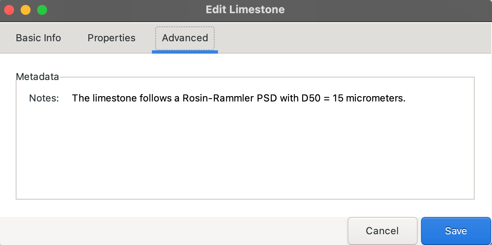

## Filler Materials

Generic inert filler materials for volume and physical effects.

### Basic Info


- **Name** - Unique identifier
- **Description** - Optional notes
- **Source** - Origin, manufacturer, or supplier information
- **Specific Gravity** - Typically 2.0 to 4.5
- **Filler Type** - Select glass or inert from the dropdown
- **Specific Surface Area** - 0.1 m²/kg to 5 m²/kg

### Properties

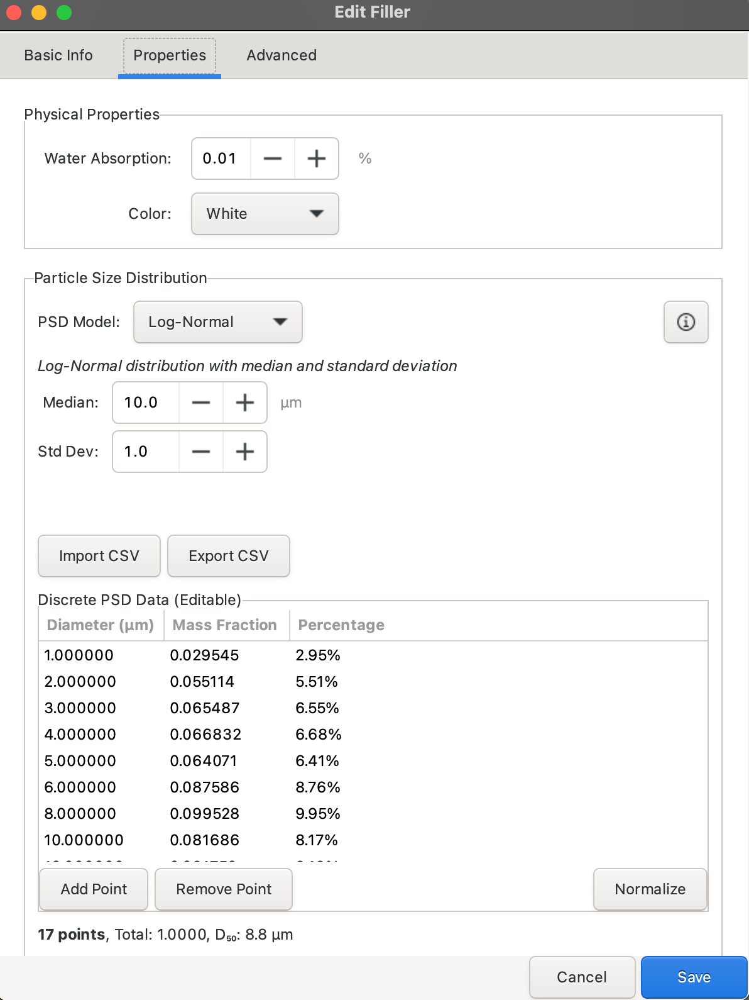

- **Water Absorption** - Mass percent on a solid mass basis (not currently used)
- **Color** - Choose best match from dropdown (not currently used)

- Filler particle size distribution (see [PSD Configuration](#particle-size-distributions) section for details).

- Typical cement PSD parameters:
    - **Distribution Type**: Rosin-Rammler
    - **Minimum Size**: 0.5 μm
    - **Maximum Size**: 60 μm
    - **Characteristic Size**: 30 μm

### Advanced Settings

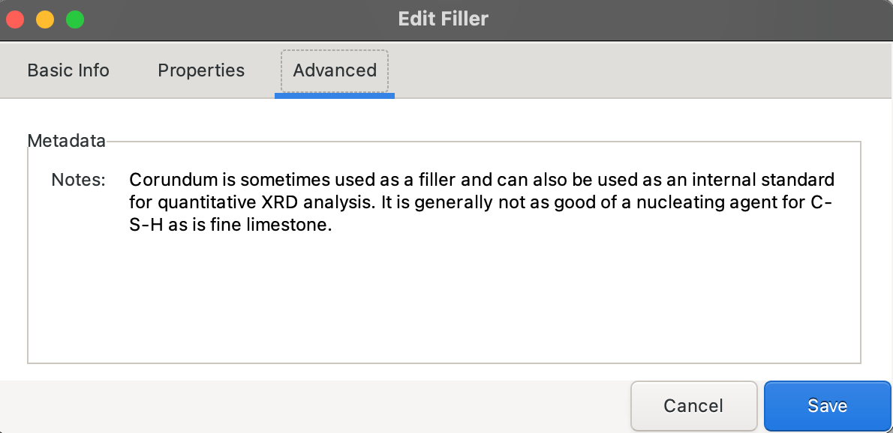

- **Metadata** - A text field for writing notes on provenance, case studies, or
  anything else relevant to the material.

## Particle Size Distributions

VCCTL supports four particle size distribution (PSD) models for powdered materials (cement, fly ash, slag, silica fume, limestone, filler).

### Rosin-Rammler Distribution


The Rosin-Rammler (Weibull) distribution is commonly used for ground materials:

$$P(d) = 1 - \exp\left[-\left(\frac{d}{d_c}\right)^n\right]$$

Where:
- $P(d)$ = Cumulative percent passing diameter $d$
- $d_c$ = Characteristic size (typically 63.2% passing)
- $n$ = Spread parameter (uniformity coefficient)

**Parameters:**
- **Minimum Size** - Smallest particle diameter (μm)
- **Maximum Size** - Largest particle diameter (μm)
- **Characteristic Size** - $d_c$ in μm (typically 10 μm  to 20 μm for cement)
- **Spread Parameter** - $n$ dimensionless (typically 0.8 to 1.2)

**Typical Values:**
- **Cement**: $d_c$ = 15 μm, $n$ = 1.0
- **Fly Ash**: $d_c$ = 20 μm, $n$ = 1.1
- **Slag**: $d_c$ = 12 μm, $n$ = 0.9

### Log-Normal Distribution


The log-normal distribution is suitable for materials with symmetric distribution on log scale:

$$P(d) = \frac{1}{2}\left[1 + \text{erf}\left(\frac{\ln(d) - \mu}{\sigma\sqrt{2}}\right)\right]$$

Where:
- $\mu$ = Mean of natural logarithm of diameter
- $\sigma$ = Standard deviation of natural logarithm

**Parameters:**
- **Minimum Size** - Smallest particle diameter (μm)
- **Maximum Size** - Largest particle diameter (μm)
- **Median Size** - $d_{50}$ in μm (50% passing size)
- **Standard Deviation** - $\sigma$ dimensionless (spread parameter)

**Typical Values:**
- **Median Size**: 10 μm to 30 μm for cementitious materials
- **Standard Deviation**: 0.3 to 0.7

### Fuller-Thompson Distribution

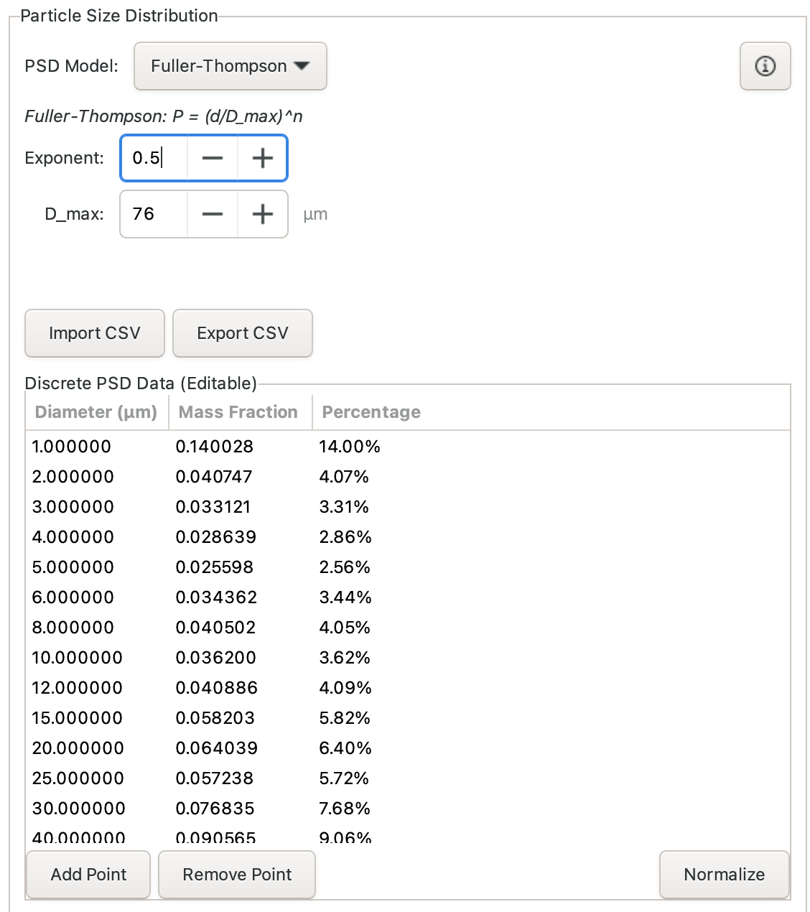

The Fuller-Thompson distribution follows a power law:

$$P(d) = \left(\frac{d}{d_{max}}\right)^q$$

Where:
- $d_{max}$ = Maximum particle size
- $q$ = Distribution exponent (typically 0.5 for Fuller's ideal curve)

**Parameters:**
- **Minimum Size** - Smallest particle diameter (μm)
- **Maximum Size** - Largest particle diameter (μm)
- **Exponent** - $q$ dimensionless (typically 0.4 to 0.6)

**Applications:**
- Ideal aggregate grading ($q$ = 0.5)
- Cement fineness distributions with adjusted exponent

### Custom Distribution

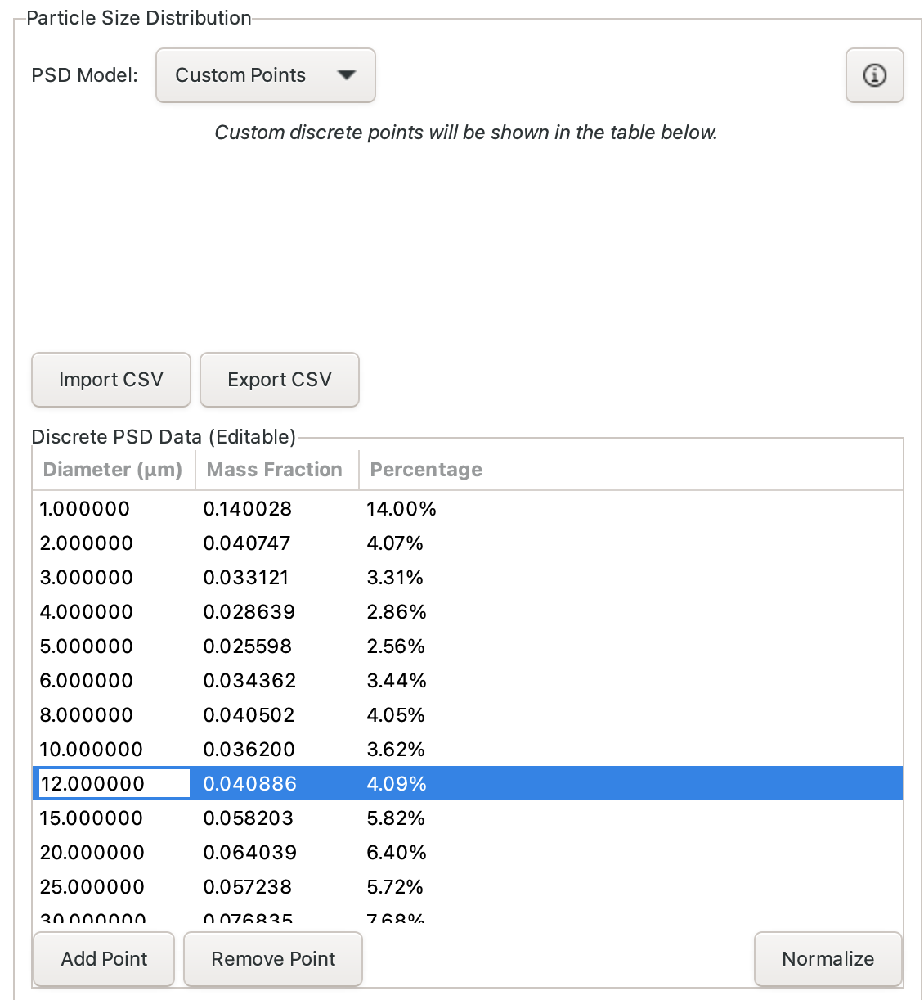

For materials with measured PSD data, enter custom cumulative distribution:

**Data Entry:**
1. Enter particle diameter (μm) in first column
2. Enter cumulative percent passing in second column
3. Data points must be in ascending order by size
4. Typically 5-20 data points provide good resolution

**Typical Data:**
```
Diameter (μm)    Percent Passing
1.0              5.0
2.0              12.0
5.0              28.0
10.0             50.0
20.0             75.0
50.0             95.0
100.0            100.0
```

## Best Practices

### Material Naming

- **Be Descriptive** - Include key characteristics in name
- **Use Consistent Convention** - Establish naming scheme for your project
- **Avoid Special Characters** - Use alphanumeric and hyphens/underscores only

**Good Examples:**
- `OPC-TypeI-380m2kg`
- `FlyAsh-ClassF-CaO8pct`
- `Slag-Grade100-450m2kg`
- `FineAgg-Silica-FM2.8`

### Property Accuracy

- **Use Test Data** - Measure properties when possible
- **Typical Values** - Use literature values for preliminary studies
- **Document Sources** - Add notes about data origin in Description field
- **Validate Consistency** - Check that related properties make sense together

### PSD Selection

- **Rosin-Rammler** - Best for ground materials (cement, slag, limestone)
- **Log-Normal** - Good for materials with measured data
- **Fuller-Thompson** - Best for aggregates with ideal grading
- **Custom** - Use when you have measured PSD data

### Database Management

- **Regular Backups** - VCCTL stores materials in SQLite database
- **Material Library** - Build comprehensive library for your common materials
- **Duplication** - Use Duplicate feature to create material variations
- **Deletion** - Only delete materials not used in any saved mix designs

## Troubleshooting

### Common Issues

**Problem**: Cannot save material - "Name already exists"
**Solution**: Choose a unique material name or delete/rename existing material

**Problem**: PSD graph not updating
**Solution**: Ensure all PSD parameters are filled and click Update or Save

**Problem**: Phase composition doesn't sum to 100%
**Solution**: Adjust phase percentages to total exactly 100.0%

**Problem**: Unrealistic property values rejected
**Solution**: Check value ranges - VCCTL validates against physical limits

### Validation Errors

VCCTL performs comprehensive validation:

- **Numeric Ranges** - Density 1000-5000 kg/m³, specific gravity 1.0-5.0
- **Composition Sums** - Cement phases must sum to 100%
- **PSD Consistency** - Min < characteristic/median < max size
- **Required Fields** - Name, material type, and key properties must be filled

---

**Next Steps:**
- **[Mix Design](mix-design.md)** - Learn how to combine materials into concrete mixes
- **[Microstructure Generation](microstructure-generation.md)** - Generate 3D particle arrangements from materials
- **[Parameter Reference](../reference/parameters.md)** - Detailed parameter descriptions and ranges
