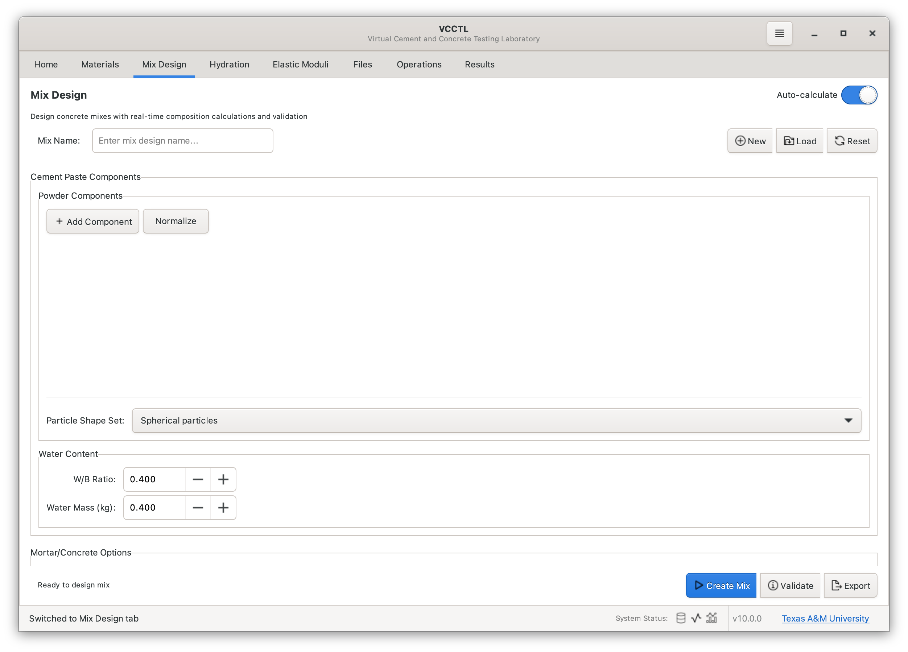
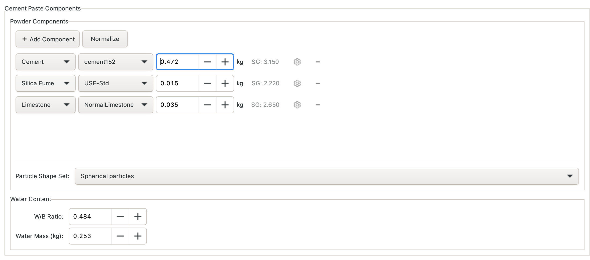
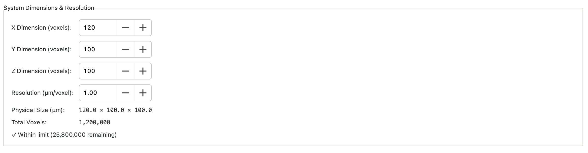
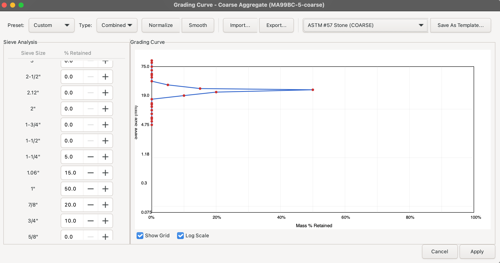
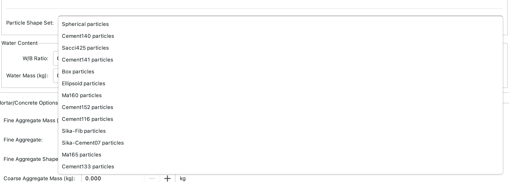
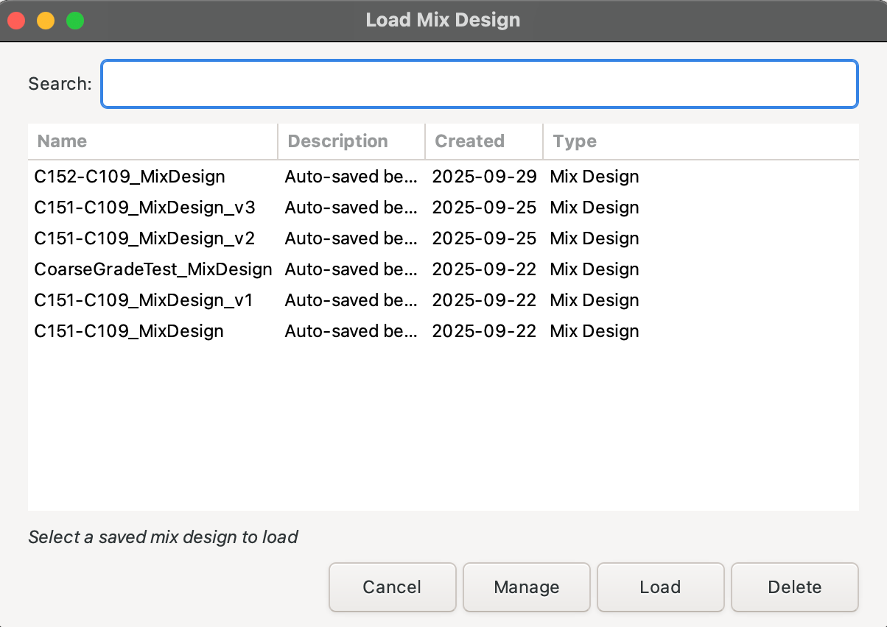

# Mix Design

The Mix Design panel allows you to create and manage concrete mixture proportions that combine materials into virtual test specimens. Mix designs are automatically saved as you work and can be loaded later for creating microstructure operations.



## Overview

Mix designs in VCCTL define:

- **Material Components** - Cement, water, aggregates, and supplementary materials
- **Proportions** - Mass or volume fractions for each component
- **System Dimensions** - Size and resolution of the virtual specimen
- **Particle Characteristics** - Shape distributions and flocculation settings
- **Aggregate Grading** - Size distributions for fine and coarse aggregates

Mix designs are automatically saved to the database and can be loaded, modified, and used for multiple microstructure generation operations.

## Mix Design Panel Interface

### Creating a New Mix Design

1. Enter a unique **Mix Design Name** at the top
2. The mix auto-saves as you add components and adjust parameters
3. All changes are immediately persisted to the database

## Adding Materials to Your Mix

### Adding Powder Components



1. Click **+ Add Component** button
2. Select **Cement** from the material type dropdown
3. Choose a specific cement from your materials library
4. Enter the **mass** in kg (for guidance, typical mass densities are 300 kg/m³ to 500 kg/m³)
5. Repeat steps 1--4 to add other components as needed

**Typical replacement levels:**
- **Fly Ash**: 15-35% cement replacement by mass
- **Slag**: 30-70% cement replacement
- **Silica Fume**: 5-10% cement addition
- **Limestone**: 5-15% cement replacement

**Common cement contents:**
- **Low strength (20 MPa to 25 MPa)**: 300 kg/m³ to 350 kg/m³
- **Normal strength (30 MPa to 40 MPa)**: 350 kg/m³ to 450 kg/m³
- **High strength (50+ MPa)**: 450 kg/m³ to 550 kg/m³

### Adding Water

Water can be added by specifying either the mass or the water-binder (w/b) mass ratio.
Whichever is specified, the other will update automatically based on the total
mass of powder components.

Typical water-binder ratios (w/b):**
- **Low (0.30-0.40)**: High strength, low permeability
- **Medium (0.40-0.50)**: Normal strength, good workability
- **High (0.50-0.65)**: Lower strength, high workability

### Adding Aggregates


Aggregates require additional configuration that can be found in the
**Mortar/Concrete Options** section.

1. Enter mass of fine aggregate in kg
2. Select the fine aggregate material source from among those in the dropdown
   menu
3. Configure **grading curve** (see [Grading Curves](#grading-curves) section)
4. Select **particle shape distribution** (see [Particle Shapes](#particle-shapes) section)

**Typical aggregate contents:**
- **Fine aggregate**: 600 kg/m³ to 900 kg/m³
- **Coarse aggregate**: 900 kg/m³ to 1200 kg/m³
- **Total aggregate**: 1500kg/m³ to 1900 kg/m³ (typically 65% to 75% by volume)


## System Dimensions and Resolution



Configure the virtual specimen size in the **System Settings** section:

### System Size

- **System Size X**: Width in voxels (typical: 100-200)
- **System Size Y**: Depth in voxels (typical: 100-200)
- **System Size Z**: Height in voxels (typical: 100-200)

### Resolution

- **Resolution**: Micrometers per voxel (currently use only 1.0; other values
have unpredictable consequences!)

**Physical size calculation:**
```
Physical size (μm) = System size (voxels) × Resolution (μm/voxel)
```

**Example:**
- System: 100 × 100 × 100 voxels
- Resolution: 1.0 μm/voxel
- Physical size: 100 × 100 × 100 μm³

### Size and Resolution Guidance

**Small Systems (Fast, less representative):**
- Size: 50 voxels to 100 voxels in each dimension
- Resolution: 1 μm/voxel
- Physical size: 50 μm to 100 μm in each dimension
- Generation time: 5 minutes to 15 minutes
- Best for: Initial testing, parameter exploration

**Medium Systems (Balanced):**
- Size: 100 voxels to 150 voxels in each dimension
- Resolution: 1.0 μm/voxel
- Physical size: 100 μm to 200 μm in each dimension
- Generation time: 15 minutes to 45 minutes
- Best for: Normal simulations, most studies

**Large Systems (Slow, most representative):**
- Size: 150 voxels to 300 voxels in each dimension
- Resolution: 1.0 μm/voxel
- Physical size: 150 μm to 300 μm in each dimension
- Generation time: 45 minutes to 90 minutes
- Best for: Final validation, publication-quality results

**Memory Requirements:**
- 100³ system: ~4 MB per phase
- 150³ system: ~14 MB per phase
- 200³ system: ~32 MB per phase
- 250³ system: ~62 MB per phase

## Grading Curves

Aggregates require grading curve definition specifying the size distribution.

### Fine Aggregate Grading


Fine aggregates use **32 sieves** from No. 4 (4.75 mm) through No. 635 (20 μm).

### Coarse Aggregate Grading



Coarse aggregates use **23 sieves** from 4" (100 mm) through No. 4 (4.75 mm).

### Grading Curve Dialog


The grading dialog provides:

1. **Sieve Table** - Enter mass percent retained on each sieve
2. **Grading Curve Plot** - Visual representation of size distribution
3. **Templates** - Load standard ASTM grading curves
4. **Save/Load** - Save custom gradings as templates

**Grading Entry Methods:**

**Method 1: Manual Entry**
- Enter percent retained for each sieve size
- Values auto-validate (sum should be ~100%)

**Method 2: Load Template**
- Click **Load Template** dropdown
- Select from standard gradings (ASTM C33, *etc*.)
- Modify if needed

**Method 3: Import Data**
- Click **Import** button
- Load CSV file with sieve data
- Format: Sieve size (mm), Percent retained

### Standard Fine Aggregate Gradings

**ASTM C33 Fine Aggregate:**
- 4.75 mm (No. 4): 0% to 10% retained
- 2.36 mm (No. 8): 0% to 20% retained
- 1.18 mm (No. 16): 0% to 35% retained
- 600 μm (No. 30): 0% to 30% retained
- 300 μm (No. 50): 0% to 15% retained
- 150 μm (No. 100): 0% to 15% retained

### Standard Coarse Aggregate Gradings

**ASTM C33 No. 67 (3/4" to No. 4):**
- Most common for normal concrete
- Maximum size: 25 mm (1 inch)
- Nominal maximum: 19 mm (3/4 inch)

**ASTM C33 No. 57 (1" to No. 4):**
- Larger stone for structural concrete
- Maximum size: 37.5 mm (1.5 inch)
- Nominal maximum: 25 mm (1 inch)

## Particle Shapes



VCCTL uses particle shape databases to represent realistic aggregate morphology using in-place reconstruction of the shapes by spherical harmonic models . For each aggregate component, select a shape distribution that matches your aggregate characteristics.

### Available Shape Sets

**Shape sets available for aggregate:**
- **Spherical** - Approximating highly weathered river gravel or sand
- **MA106A-1-fine** - Experimentally measured shapes for ASTM C33 standard sand
- **MA107-6-fine** - Experimentally measured shapes for European standard sand
EN 196-1
- **MA114F-3-fine** - Experimentally measured shapes for AASHTO Proficiency sand
  #9
- **MA106B-4-coarse** - Experimentally measured shapes for an ASTM #57 stone
- **MA111-7-coarse** - Experimentally measured shapes for AASHTO coarse
limestone proficiency sample #137-#138
- **MA99BC-5-coarse** - Experimentally measured shapes for a coarse steel slag
aggregate

**Best practice:**
- Use measured shape data when available
- Match visual appearance of your aggregate
- Spherical shapes are easiest to pack (faster generation)
- Angular shapes are more realistic for crushed stone

## Powder Dispersion Options


Dispersion settings control the agglomeration behavior of powder particles in fresh concrete binder.

### Flocculation Parameters

The user can choose to enable flocculation/agglomeration by checking the "Enable
Flocculation" box and then entering the degree of flocculation. The degree of
flocculation is equation to one minus the ratio of the number of agglomerates to
the number of primary particles.

Alternatively, the user can choose to enforce the strict separation of all
particles by leaving the "Enable flocculation" box unchecked and then entering a
dispersion distance of one or two voxels.

The default is to simulate neither flocculation nor dispersion but to simply
locate particles by a random parking algorthm that avoids overlap.

### Effect on Properties

**Well-dispersed cement (small flocs):**
- ✓ Faster hydration kinetics
- ✓ More uniform property development
- ✓ Lower permeability
- ✗ May be unrealistic for low w/c ratios

**Strongly flocculated cement (large flocs):**
- ✓ More realistic for typical concrete
- ✓ Captures effects of mixing and consolidation
- ✗ Slower hydration kinetics
- ✗ Higher permeability

**Recommendation:** Use the default behavior of random parking unless simulating
the effect of a strong superplasticizer.

## Mixture Validation


Clicking on the **Validate** button will automatically validate  mix designs and warn  about potential issues:

### Validation Checks

**Volume Balance:**
- Total component volumes should not exceed 100% of system volume
- Accounts for material specific gravities
- Shows warning if overfilled (>105%) or underfilled (<85%)

**Water-Cement Ratio:**
- Calculates w/b based on powder and water masses
- Warns if w/b < 0.25 (very low, difficult hydration) or w/b > 0.70 (high, poor durability)

**Aggregate Distribution:**
- Checks fine/coarse aggregate ratio
- Warns if imbalanced (should be roughly 40/60 to 60/40)

**Material Compatibility:**
- Ensures materials are chemically compatible
- Warns about unusual combinations

### Mixture Summary

The Mixture Summary panel shows:

- **Total Mass**: Sum of all component masses (kg)
- **Total Volume**: Calculated volume accounting for specific gravities (% of specimen)
- **Air Content**: Using user-prescribed value in the **Mortar/Concrete
Options** section
- **w/b Ratio**: Water-to-cement mass ratio
- **Aggregate Ratio**: Fine-to-total aggregate volume ratio

### Creating the Mixture

Once all the mixture parameters are set and validated, a 3D reconstruction of
the mixture can be made by clicking the **Create Mix** button. Clicking this
button will also save the mixture design by name so that it can be loaded back
in the future without having to re-enter all the parameters.

## Loaded Mixture Design


Once you've configured all components and parameters, your complete mix design shows:

1. All material components with masses
2. System dimensions and resolution
3. Aggregate grading curves (configured)
4. Particle shape selections
5. Flocculation settings
6. Mix summary with calculated properties

## Loading Saved Mix Designs



To load a previously saved mix:

1. Click **Load Mix** button
2. Select from list of saved mix designs
3. All parameters load automatically
4. Modify as needed (creates a new mix design if you change the name)


The list shows:
- Mix design name
- Date created
- Date last modified
- Component summary

## Best Practices

### Mix Design Strategy

**1. Start Simple**
- Begin with cement + water + one aggregate
- Validate behavior before adding complexity
- Gradually add supplementary materials

**2. Use Realistic Proportions**
- Follow industry-standard mix designs (ACI 211, etc.)
- Typical total mass: 2200-2400 kg/m³
- Typical air content: 1-8%

**3. Match Your Application**
- **Structural concrete**: w/c = 0.40-0.50, normal strength
- **High-performance**: w/c = 0.30-0.40, SCMs, good aggregate
- **Mass concrete**: w/c = 0.45-0.55, low heat cement, fly ash

**4. Consider Computational Cost**
- Start with small systems (100 voxels) for testing
- Use larger systems (150-200 voxels) for final results
- Balance resolution with system size

### Material Selection

**Cement:**
- Use measured cement data when possible
- Portland cement Type I/II for most applications
- Adjust phase composition for special cements

**Water:**
- Simple: just specify mass
- w/c ratio is key parameter for strength and durability

**Aggregates:**
- Use realistic grading curves (ASTM C33)
- Match particle shapes to your actual aggregate
- Include both fine and coarse for realistic packing

**SCMs:**
- Add fly ash for sulfate resistance, reduced heat
- Add slag for long-term strength, reduced permeability
- Add silica fume for ultra-high strength, dense microstructure

### System Dimensions

**Small Studies (parameter exploration):**
- 100³ voxels at 1 μm/voxel = 100 μm cube
- Fast generation (~10 minutes)
- Good for testing different mixes

**Production Studies (most work):**
- 150³ voxels at 1 μm/voxel = 150 μm cube
- Reasonable generation time (~30 minutes)
- Good balance of speed and accuracy

**Publication Studies (final validation):**
- 200³ voxels at 0.5 μm/voxel = 100 μm cube (high resolution)
- Slow generation (~2 hours)
- Best accuracy and detail

## Common Mixture Design Examples

### Example 1: Normal Strength Concrete

**Target**: 35 MPa (5000 psi) structural concrete

**Proportions:**
- Portland Cement Type I: 375 kg/m³
- Water: 168 kg/m³ (w/c = 0.45)
- Fine Aggregate: 750 kg/m³
- Coarse Aggregate: 1065 kg/m³
- Total: 2358 kg/m³

**System**:
- Size: 150 × 150 × 150 voxels
- Resolution: 1.0 μm/voxel

### Example 2: High-Performance Concrete with Fly Ash

**Target**: 60 MPa (8700 psi) with durability

**Proportions:**
- Portland Cement Type I: 350 kg/m³
- Fly Ash Class F: 100 kg/m³
- Water: 153 kg/m³ (w/(c+0.6f) = 0.34)
- Fine Aggregate: 700 kg/m³
- Coarse Aggregate: 1050 kg/m³
- Total: 2353 kg/m³

**System:**
- Size: 150 × 150 × 150 voxels
- Resolution: 1.0 μm/voxel

### Example 3: Ultra-High Performance Concrete with Silica Fume

**Target**: 120 MPa (17400 psi) UHPC

**Proportions:**
- Portland Cement Type III: 800 kg/m³
- Silica Fume: 80 kg/m³
- Water: 176 kg/m³ (w/cm = 0.20)
- Fine Aggregate (fine sand): 1020 kg/m³
- Total: 2076 kg/m³

**System:**
- Size: 100 × 100 × 100 voxels
- Resolution: 1.0 μm/voxel

## Troubleshooting

### Common Issues

**Problem:** "Volume exceeds 100%" warning
**Solution:** Reduce component masses or increase system size. Check that specific gravities are correct.

**Problem:** Aggregate grading won't save
**Solution:** Ensure all required sieves have values. Total percent retained should be ~100%.

**Problem:** Mix design name already exists
**Solution:** Choose a unique name or load the existing mix to modify it.

**Problem:** Unrealistic w/c ratio warning
**Solution:** Check water and cement masses. Typical range is 0.30-0.60 for normal concrete.

### Validation Warnings

**"Air content is high (>10%)"**
- Check if component masses are too low
- Verify specific gravities are correct
- Some air is normal (1-8%), but >10% may indicate error

**"Fine/coarse aggregate ratio unusual"**
- Typical ratio is 40/60 to 60/40 (fine/total aggregate)
- Very high fine content may cause packing issues
- Very high coarse content may have insufficient fines

**"Very low/high w/c ratio"**
- w/c < 0.30: Difficult to hydrate, may not reach full degree of hydration
- w/c > 0.65: Poor durability, high permeability, lower strength

---

**Next Steps:**
- **[Microstructure Generation](microstructure-generation.md)** - Generate 3D particle arrangements from your mix design
- **[Materials Management](materials-management.md)** - Learn about material properties and definitions
- **[Workflows](../workflows/parameter-studies.md)** - Systematic mix design parameter studies
