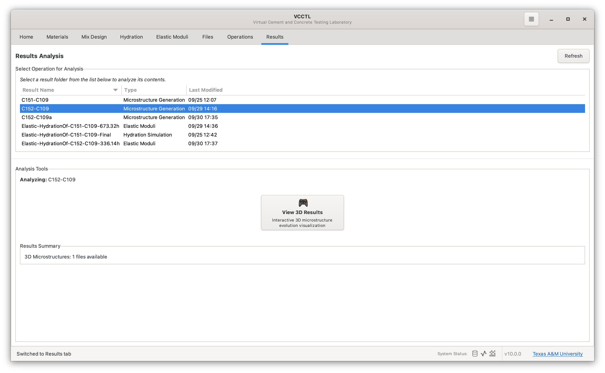
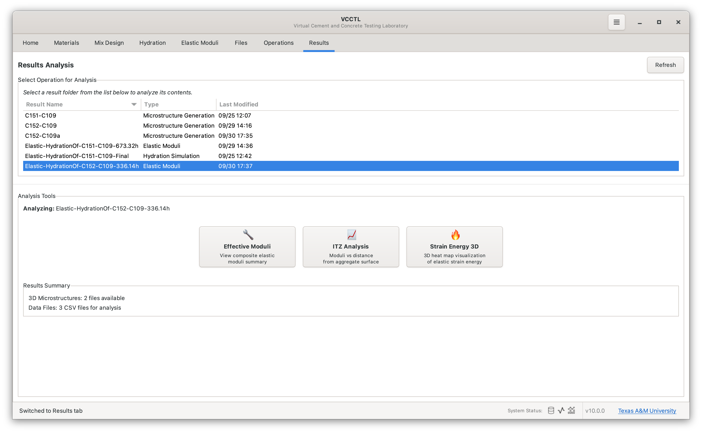
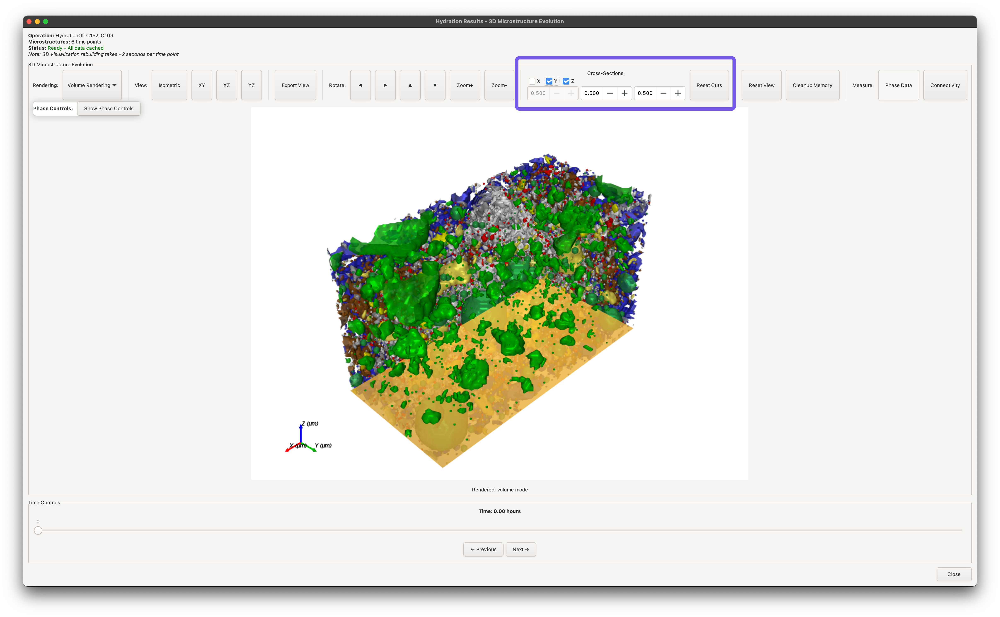
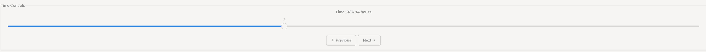
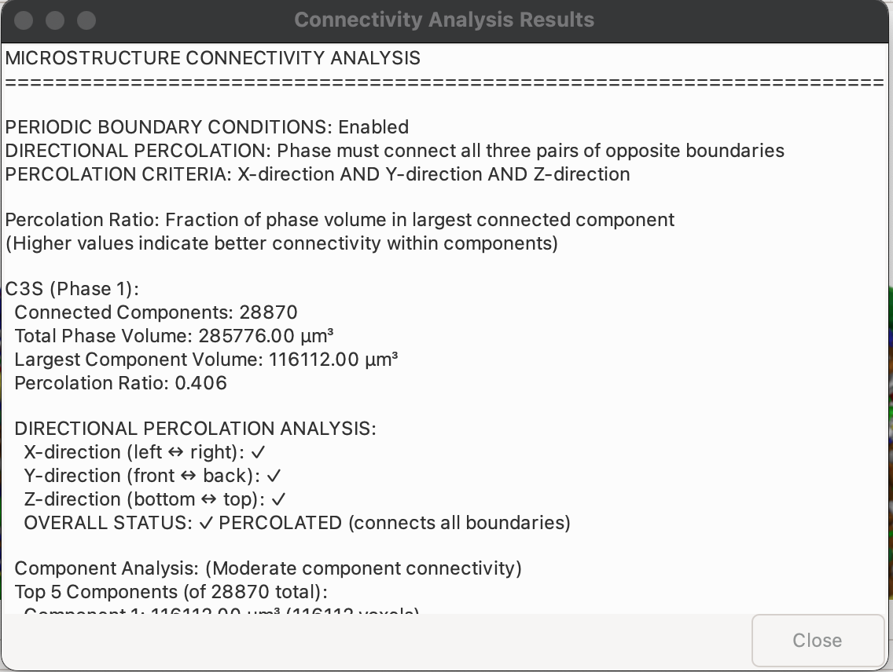
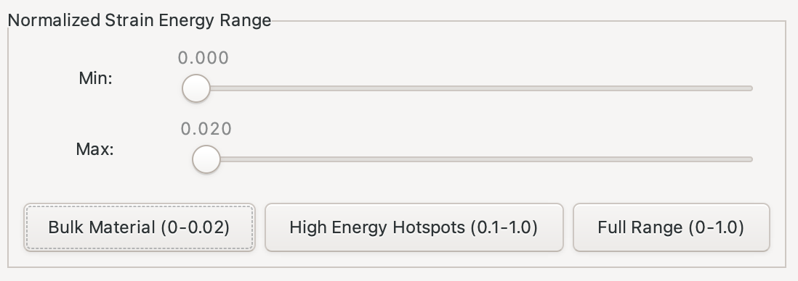
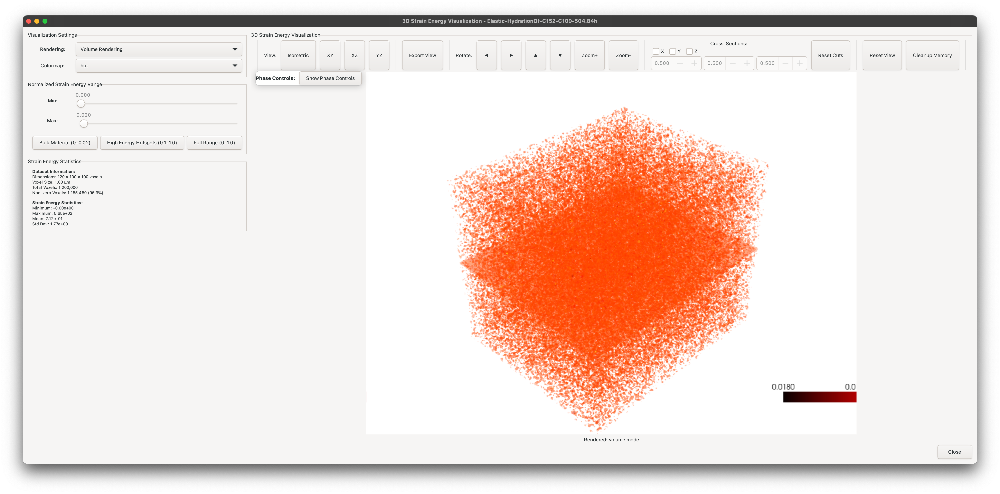
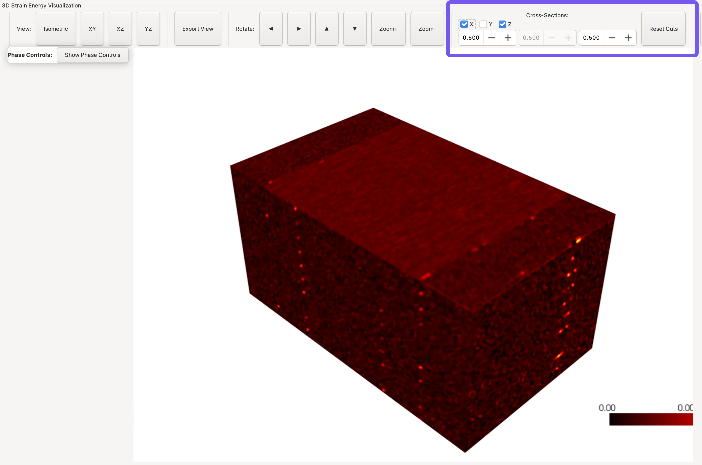

# Results Visualization

## Overview

The **Results** panel in VCCTL provides a centralized location for viewing and analyzing outputs from all completed operations. Whether you've generated microstructures, run hydration simulations, or calculated elastic moduli, this panel gives you access to visualization tools, data plots, and export capabilities.

**Key capabilities:**

- View 3D microstructure visualizations with phase coloring
- Plot hydration degree of hydration and heat evolution
- Analyze strain energy distributions in 3D
- Examine interfacial transition zone (ITZ) properties
- Perform connectivity and percolation analysis
- Export data for external analysis

---

## Accessing the Results Panel

1. Click the **Results** tab in the left sidebar
2. The panel displays a list of all completed operations
3. Select an operation to view available visualization options
4. Click action buttons on the right to open specific viewers

---

## Understanding Operation Types

The Results panel displays different visualization buttons depending on operation type:

### Microstructure Operations

Operations created from the Mix Design panel after pressing "Create Mix".

**Available visualizations:**

- **View 3D**: Interactive 3D microstructure viewer with phase data
- **Phase Data**: Detailed phase volume fractions and statistics

### Hydration Operations

Operations created from the Hydration panel simulating cement hydration over time.

**Available visualizations:**

- **View 3D**: 3D viewer with time slider for hydration snapshots
- **Plot Data**: Charts showing degree of hydration and heat evolution

### Elastic Moduli Operations

Operations created from the Elastic Moduli panel calculating mechanical properties.

**Available visualizations:**

- **View Effective Moduli**: Table of calculated elastic properties
- **View Strain Energy 3D**: 3D heat map of strain energy distribution
- **View ITZ Analysis**: Plots of property variation near aggregates (if present)

---

## 3D Microstructure Visualization

The 3D viewer provides interactive exploration of microstructure geometry and phase distribution.

### Opening the 3D Viewer

1. Select a microstructure or hydration operation in the Results panel
2. Click **"View 3D"**
3. The PyVista-based viewer opens with the microstructure rendered

### Navigation and Camera Controls

**Rotation Controls:**

- **Left/Right/Up/Down Arrow Boxes**: Rotate view around center
- **Zoom+/Zoom-**: Zoom in/out

**Camera Views:**

Use the camera preset buttons to switch between standard orientations:

- **Isometric**: 3D perspective view showing depth
- **XY Plane**: Top-down view (looking down Z-axis)
- **XZ Plane**: Front view (looking along Y-axis)
- **YZ Plane**: Side view (looking along X-axis)

!!! tip "Navigation Tips"
    - Start with **Isometric** view to get overall 3D perspective
    - Switch to **orthographic views (XY, XZ, YZ)** for precise alignment inspection
    - Use **Zoom+** to focus on regions of interest

### Rendering Modes for Microstructure Visualization

The viewer offers four rendering modes optimized for different purposes:

**Volume Mode** (default):

- Renders solid volumes of each phase
- Best for visualizing overall structure
- Good rendering performance

**Isosurface Mode**:

- Renders solid surfaces of each phase
- Best for visualizing overall structure
- Faster rendering performance
- Clear phase boundaries

**Pixel Art Mode**:

- Shows individual voxels as small cubes
- Useful for detailed inspection at high zoom
- Reveals discrete nature of simulation grid
- Slower rendering for large systems

**Wireframe Mode**:

- Indicates surfaces as a transparent mesh of wires
- Useful for overall inspection of sparse microstructures
- Not available for visualizing strain energy heat maps

---

## Phase Data and Visibility Control

Understand microstructure composition and control which phases are visible.

### Viewing Phase Data

Click the **"Phase Data"** button in the toolbar to view detailed phase statistics:

**Information displayed:**

| Column | Description |
|--------|-------------|
| **Phase Name** | Material phase (*e.g.*, C₃S, C₂S, CSH, Porosity) |
| **Phase ID** | Numerical identifier in microstructure file |
| **Voxel Count** | Number of voxels occupied by this phase |
| **Volume Fraction** | Percentage of total volume (%) |
| **Color** | RGB color used for visualization |

!!! note "Phase Evolution"
    For hydration operations, phase volumes change over time. Use the time slider (see below) to see how phases evolve during hydration.

### Phase Visibility Controls

Control which phases are displayed to focus on specific features:

**Checkbox Controls:**

- **Check**: Phase is visible in 3D view
- **Uncheck**: Phase is hidden from view
- **Color Swatch**: Click to change phase color

!!! tip "Phase Visibility"

The spinbox next to each phase can be used adjust the transparency of that phase

**Common Analysis Workflows:**

- **Hide porosity**: See only solid phases to understand particle packing
- **Show only one phase**: Isolate specific cement compound or hydration product
- **Hide aggregates**: Focus on paste microstructure
- **Show only capillary porosity**: Visualize pore network connectivity

---

## Cross-Section Analysis

View internal structure by cutting through the microstructure along specific planes.

### Enabling Cross Sections

Three independent clipping planes are available:

- **X Plane**: Cuts perpendicular to X-axis
- **Y Plane**: Cuts perpendicular to Y-axis
- **Z Plane**: Cuts perpendicular to Z-axis

**To create a cross section:**

1. Check the checkbox for desired plane (e.g., "Z Plane")
2. Adjust the slider to move the cutting plane position
3. The view updates in real-time showing the cross section

**Position Spinbox:**

- **Left (0%)**: Plane at minimum coordinate (start of axis)
- **Middle (50%)**: Plane at center of microstructure
- **Right (100%)**: Plane at maximum coordinate (end of axis)

### Cross-Section Analysis Applications

**Single Plane:**

- View 2D slice showing phase distribution
- Examine particle size distribution
- Inspect hydration product morphology at specific location

**Two Perpendicular Planes:**

- Create corner view showing two internal faces
- Better spatial understanding of 3D structure
- Useful for presentations and publications

**Three Planes:**

- Isolate specific internal region
- Focus on localized phenomena (e.g., around one aggregate particle)
- Study microstructure at specific coordinates

!!! tip "Best Practice"
    Start with Z-plane at 50% to see a central horizontal slice. This often provides the most representative view of the overall microstructure.

---

## Hydration Time Evolution

For hydration operations, explore how the microstructure changes over simulation time.

### Using the Time Slider

**Accessing time snapshots:**

1. Open 3D viewer for a hydration operation
2. Locate the **time slider** at the bottom of the viewer
3. Drag the slider or click time markers to load different snapshots

**Time Information:**

- **Time Labels**: Show simulation time (e.g., "0.0 h", "24.0 h", "168.0 h")
- **Current Time**: Displayed prominently above slider
- **Snapshot Count**: Shows available time points (e.g., "Snapshot 5 of 12")

### Observing Hydration Progress

As you move through time, observe:

**Early Times (0 hours to 24 hours):**

- Anhydrous cement particles visible (C₃S, C₂S, C₃A, C₄AF phases)
- Initial formation of hydration products (CSH, CH)
- Rapid porosity reduction

**Middle Period (1 day to 7 days):**

- Continued cement dissolution
- Growing CSH and CH phases filling pore space
- Microstructure densification

**Later Times (7+ days):**

- Most cement hydrated
- Dominant CSH phase
- Residual unreacted cement particles (if any)
- Final porosity distribution

!!! tip "Animation Workflow"
    Manually step through time snapshots to create animation frames for presentations. Use consistent camera angle and phase visibility settings across all frames.

---

## Connectivity Analysis

Analyze percolation and connectivity of specific phases through the microstructure.

### Performing Connectivity Analysis

1. Open 3D viewer for any operation
2. Click the **"Connectivity"** button in the toolbar
3. The analysis runs (may take 30 seconds to 2 minutes)
4. Results appear in a dialog showing connectivity statistics

### Understanding Connectivity Results

The analysis identifies **connected components** - regions of the same phase that form continuous paths through the microstructure.

**Key Metrics:**

| Metric | Description |
|--------|-------------|
| **Total Components** | Number of separate connected regions |
| **Largest Component** | Volume of biggest connected region |
| **Percolation** | Whether phase forms connected path across system |

**Percolation Status:**

- **X-direction**: Phase connects from left to right face
- **Y-direction**: Phase connects from front to back face
- **Z-direction**: Phase connects from bottom to top face

### Interpreting Results

**Porosity Connectivity:**

- **Percolating**: Fluid can flow through the microstructure
- **Non-percolating**: Isolated pores, impermeable material
- Critical for transport property predictions

**CSH Connectivity:**

- **Well-connected**: Good load-bearing network
- **Isolated regions**: Potential weak points
- Related to mechanical property development

**Unhydrated Cement:**

- **Many small components**: Well-dispersed particles
- **Few large components**: Particle clustering
- Affects hydration kinetics and final properties

!!! note "Periodic Boundaries"
    VCCTL implements periodic boundary conditions, meaning phases that reach one boundary are considered connected to the opposite boundary. This represents an infinite periodic array of the simulated volume.

---

## Hydration Data Plotting

View quantitative time-series data from hydration simulations.

### Opening Plot Viewer

1. Select a hydration operation in Results panel
2. Click **"Plot Data"** button
3. A matplotlib-based plot window opens

### Available Plots

You may select any variable as the abcissa for the plot. Typically time or
degree of hydration are used for the abcissa.

You may also select one or any number of other properties to display as the ordinate.
Each property selected will be plotted as a separate curve with a different
color.

!!! note "Commensurate Units"
    The graphing utility allows you to plot data that have mutually
incommensurate units. For example, you can simultaneously plot temperature and degree of
hydration versus time on the same plot. This is not advised because it makes
interpretation of the plots difficult.

### Common Plots

**Degree of Hydration vs Time:**

- Shows fraction of cement that has reacted (0.0 to 1.0)
- X-axis: Time (hours or days)
- Y-axis: Degree of hydration (dimensionless)
- Typically shows rapid early growth then asymptotic approach to final value

**Cumulative Heat Evolution:**

- Shows total heat released by hydration reactions
- X-axis: Time (hours or days)
- Y-axis: Heat (J/g of cement)
- Used for comparison with calorimetry experiments

**Heat Rate:**

- Shows instantaneous rate of heat release
- X-axis: Time (hours or days)
- Y-axis: Heat rate (W/g of cement)
- Shows characteristic peaks corresponding to different reaction stages

### Plot Interaction

**Zoom and Pan:**

- **Zoom**: Draw rectangle with left mouse button
- **Pan**: Right-click and drag
- **Reset**: Click home icon in toolbar

**Export:**

- Click save icon to export as PNG, PDF, or SVG
- Use for publications and presentations

!!! success "Validation Workflow"
    Export degree of hydration and heat data to CSV, then plot alongside experimental calorimetry measurements to validate time calibration parameters.

---

## Strain Energy Visualization

For elastic operations, visualize 3D distribution of strain energy density.

### Accessing Strain Energy Viewer

1. Select an elastic operation in Results panel
2. Click **"View Strain Energy 3D"** button
3. PyVista viewer opens with strain energy heat map

### Strain Energy Heat Map

**Color Scale:**

- **Blue/Green**: Low strain energy (uniform stress)
- **Yellow/Orange**: Moderate strain energy
- **Red**: High strain energy (stress concentrations)

**Normalized Scale:**

- Values range from 0.0 to 1.0
- Normalization allows comparison between different operations
- Absolute values depend on applied boundary conditions

### Threshold Control

Adjust threshold range to focus on specific energy levels:

**Preset Buttons:**

- **Bulk Material (0-0.02)**: View majority of material with low strain energy
- **High Energy Hotspots (0.1-1.0)**: Focus on critical stress concentration regions
- **Full Range (0-1.0)**: See complete energy distribution

**Custom Range:**

- Drag **Min** and **Max** sliders to set custom range
- Real-time update as you adjust thresholds
- Useful for exploring specific energy bands

### Rendering Modes

**Isosurface Rendering:**

- Shows surfaces of constant strain energy
- Smooth, continuous appearance
- Best for understanding overall distribution
- Faster rendering

**Volume Rendering:**

- Semi-transparent volume display
- Shows internal energy gradients
- Reveals 3D structure of stress fields
- Slower rendering but more detailed

**Pixel Rendering:**

- Shows individual voxels
- Highest detail level
- Useful for zooming into specific regions
- Slowest rendering for large volumes

### Strain Energy Cross Sections

Combine strain energy visualization with cross-section planes:

1. Enable one or more cross-section planes (X, Y, or Z)
2. Adjust plane position with slider
3. View strain energy distribution on internal slices
4. Identify locations of high energy within microstructure

**Analysis Applications:**

- Locate ITZ stress concentrations near aggregates
- Find pores acting as stress concentrators
- Identify potential crack initiation sites
- Understand load transfer paths through microstructure

---

## Effective Moduli Results

View calculated composite elastic properties for elastic operations.

### Opening Moduli Viewer

1. Select an elastic operation in Results panel
2. Click **"View Effective Moduli"** button
3. Table dialog displays calculated properties

**Results Displayed:**

| Property | Typical Value | Description |
|----------|---------------|-------------|
| Bulk Modulus | 15 GPa  to 22 GPa | Resistance to compression |
| Shear Modulus | 10 GPa to 15 GPa | Resistance to shear deformation |
| Elastic Modulus | 25 GPa to 40 GPa | Young's modulus (with aggregates) |
| Poisson's Ratio | 0.20 to 0.30 | Lateral strain ratio |

### Exporting Moduli Data

Click **"Export"** button to save results as CSV file with columns:

- Property name
- Calculated value
- Units (GPa or dimensionless)
- Timestamp of calculation

Use exported data for:

- Time series plots of property evolution
- Comparison with experimental measurements
- Input to structural analysis software
- Publication and reporting

---

## ITZ Analysis

Examine how elastic properties vary with distance from aggregate surfaces.

### Opening ITZ Viewer

1. Select an elastic operation with aggregates in Results panel
2. Click **"View ITZ Analysis"** button
3. Dialog opens with data table and property plots

**Available Property Plots:**

- Bulk Modulus vs Distance
- Shear Modulus vs Distance
- Elastic Modulus vs Distance
- Poisson's Ratio vs Distance

### ITZ Plot Features

**Data Visualization:**

- **Blue scatter points**: Individual voxel properties vs distance from nearest aggregate
- **Green vertical line**: ITZ width (median cement particle diameter)
- **Orange horizontal line**: Average property within ITZ
- **Purple horizontal line**: Average property outside ITZ
- **Text annotations**: Numerical values with colored backgrounds

### Interpreting ITZ Data

**Typical Observations:**

- **Property drop near aggregates**: Lower values at distance ≈ 0 μm
- **Property recovery**: Values increase with distance
- **Bulk plateau**: Properties stabilize beyond ITZ width (~20-50 μm)
- **Quantitative difference**: ITZ properties typically 20-40% lower than bulk

**Scientific Applications:**

- Validate simulation against experimental ITZ measurements
- Understand microcracking susceptibility near aggregates
- Optimize aggregate properties to minimize ITZ weakening
- Study effect of SCMs (fly ash, slag) on ITZ properties

### Exporting ITZ Data

Click **"Export Data"** to save CSV file with columns:

- Distance from aggregate (μm)
- Bulk modulus (GPa)
- Shear modulus (GPa)
- Elastic modulus (GPa)
- Poisson's ratio

Use for custom plotting, statistical analysis, or publication figures.

---

## Best Practices

### Visualization Strategy

1. **Start with overview**: Use default isometric view to get spatial orientation
2. **Use phase controls**: Hide/show phases to isolate features of interest
3. **Apply cross sections**: View internal structure systematically
4. **Adjust camera**: Switch between perspective and orthographic views as needed
5. **Export images**: Save views for documentation and presentations

### Data Export Workflow

1. **Visualize first**: Understand results through interactive exploration
2. **Identify interesting features**: Note specific times, regions, or phases
3. **Export quantitative data**: Save numerical results as CSV
4. **Create publication plots**: Use exported data in plotting software (Python, MATLAB, Origin)
5. **Archive visualizations**: Save key 3D views as high-resolution images

### Performance Optimization

**For large microstructures (>200³ voxels):**

- Use isosurface mode instead of volume rendering
- Hide phases not currently needed
- Avoid activating all three cross-section planes simultaneously
- Close viewer when not actively analyzing

**For time-series hydration:**

- Load one time snapshot at a time rather than cycling rapidly
- Set consistent phase visibility before stepping through time
- Export time-series data for quantitative analysis rather than visual inspection

### Quality Visualization for Publications

**3D Microstructure Images:**

- Use isometric view for 3D perspective
- Enable cross-section planes to show internal structure
- Hide porosity for clearer phase boundaries
- Set white or light gray background for print clarity
- Export at high resolution (>1200 DPI)

**Plot Export:**

- Use vector formats (PDF, SVG) when possible for scalability
- Ensure axis labels and legends are readable
- Use high-contrast colors for accessibility
- Include error bars or uncertainty bands if applicable

---

## Troubleshooting

### 3D Viewer Issues

**Viewer opens but shows black/blank screen:**

- Check that operation completed successfully
- Verify microstructure files exist in Operations folder
- Try restarting VCCTL to refresh PyVista backend

**Slow rendering performance:**

- Switch to isosurface mode
- Hide unnecessary phases
- Disable cross-section planes
- Close other open viewers
- Consider smaller system sizes in future simulations

**Phase colors all look similar:**

- Click color swatches in phase controls
- Choose more contrasting colors manually
- Use colorblind-friendly palettes for accessibility

### Plot Display Issues

**"No data available for plotting":**

- Ensure hydration simulation saved time-series output
- Check that simulation ran to completion
- Verify progress.json or output files exist

**Plot appears but shows unexpected values:**

- Verify time units match expectations (hours vs days)
- Check that degree of hydration is between 0 and 1
- Compare heat values to typical Portland cement (300 J/g  to 400 J/g total)

### Export Problems

**Export button does not work:**

- Check disk space availability
- Verify write permissions for output directory
- Try exporting to different location
- Check for special characters in filename

---

## Summary

The Results Visualization system in VCCTL provides:

- ✅ Interactive 3D exploration of microstructure geometry
- ✅ Phase-by-phase visibility control and analysis
- ✅ Cross-sectional views of internal structure
- ✅ Time evolution visualization for hydration
- ✅ Connectivity and percolation analysis
- ✅ Quantitative plotting of hydration kinetics
- ✅ Strain energy distribution visualization
- ✅ ITZ property analysis and export

These tools enable you to:

- **Understand** microstructure development during hydration
- **Validate** simulations against experimental data
- **Identify** critical features affecting properties
- **Publish** high-quality visualization and data
- **Communicate** results to collaborators and stakeholders

!!! success "Next Steps"
    - [Operations Monitoring](operations-monitoring.md) - Manage running calculations
    - [Elastic Calculations](elastic-calculations.md) - Compute mechanical properties
